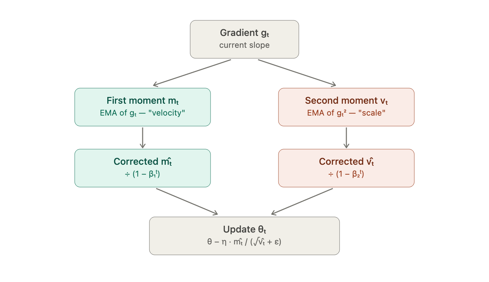

## Table of Contents

- [PART 1 - ACTIVATION FUNCTIONS](#part-1-activation-functions)
    - [Why do we need activation functions?](#why-do-we-need-activation-functions)
    - [1. Sigmoid (Logistic Function)](#1-sigmoid-logistic-function)
    - [2. Tanh (Hyperbolic Tangent)](#2-tanh-hyperbolic-tangent)
    - [3. ReLU (Rectified Linear Unit)](#3-relu-rectified-linear-unit)
    - [4. Leaky ReLU](#4-leaky-relu)
    - [5. Parametric ReLU (PReLU)](#5-parametric-relu-prelu)
    - [6. ELU (Exponential Linear Unit)](#6-elu-exponential-linear-unit)
    - [7. SELU (Scaled Exponential Linear Unit)](#7-selu-scaled-exponential-linear-unit)
    - [8. SiLU / Swish (Sigmoid Linear Unit)](#8-silu-swish-sigmoid-linear-unit)
    - [9. GELU (Gaussian Error Linear Unit)](#9-gelu-gaussian-error-linear-unit)
    - [10. Softmax](#10-softmax)
    - [11. Softplus](#11-softplus)
    - [12. Mish](#12-mish)
    - [Quick Comparison Table - Activations](#quick-comparison-table-activations)
- [PART 2 - OPTIMIZERS](#part-2-optimizers)
    - [The Core Optimization Problem](#the-core-optimization-problem)
    - [1. Batch Gradient Descent](#1-batch-gradient-descent)
    - [2. Stochastic Gradient Descent (SGD)](#2-stochastic-gradient-descent-sgd)
    - [3. Mini-Batch Gradient Descent](#3-mini-batch-gradient-descent)
    - [4. SGD with Momentum](#4-sgd-with-momentum)
    - [5. Nesterov Accelerated Gradient (NAG)](#5-nesterov-accelerated-gradient-nag)
    - [6. Adagrad](#6-adagrad)
    - [7. RMSProp](#7-rmsprop)
    - [8. Adadelta](#8-adadelta)
    - [9. Adam](#9-adam)
    - [10. AdamW](#10-adamw)
    - [11. Nadam](#11-nadam)
    - [12. AMSGrad](#12-amsgrad)
    - [13. LAMB](#13-lamb)
    - [14. LARS](#14-lars)
    - [15. Lion](#15-lion)
    - [Comparison Summary - Optimizers](#comparison-summary-optimizers)

---

# PART 1 - ACTIVATION FUNCTIONS

## Why do we need activation functions?

Without activation functions, a neural network — no matter how deep — collapses into a single linear transformation. Stacking linear layers gives you another linear function:

$$f(x) = W_3(W_2(W_1 x)) = W x$$

Non-linearity is what lets networks learn complex patterns like edges in images, syntax in language, or decision boundaries in classification.

> 
> - **Non-linearity** — enables learning complex functions
> - **Differentiability** — needed for backpropagation
> - **Range** — affects gradient flow and output interpretation
> - **Computational cost** — matters at scale
> - **Zero-centered output** — helps gradients flow symmetrically
> - **Monotonicity** — helps optimization converge

---

## 1. Sigmoid (Logistic Function)

**Formula:** $$\sigma(x) = \frac{1}{1 + e^{-x}}$$

**Derivative:** $$\sigma'(x) = \sigma(x) \cdot (1 - \sigma(x))$$

**Range:** $(0, 1)$ — never actually reaches 0 or 1

### Behavior

- $\sigma(0) = 0.5$
- $\sigma(2) \approx 0.88$
- $\sigma(-2) \approx 0.12$
- $\sigma(10) \approx 0.9999$ (saturated)
- $\sigma(-10) \approx 0.00004$ (saturated)

### ✅ Advantages

- Smooth, differentiable everywhere
- Output interpretable as a probability
- Bounded output prevents exploding activations

### ❌ Disadvantages

> **Warning:** Vanishing Gradient Problem Maximum gradient is **0.25** (at x=0). When you stack many layers, gradients multiply and shrink toward zero, so early layers stop learning.

- **Not zero-centered:** Outputs always positive, causing zig-zag gradient updates
- **Computationally expensive:** Contains an exponential

### 🎯 Use Case

Output layer for binary classification, gates in LSTMs/GRUs.

---

## 2. Tanh (Hyperbolic Tangent)

**Formula:** $$\tanh(x) = \frac{e^x - e^{-x}}{e^x + e^{-x}} = 2\sigma(2x) - 1$$

**Derivative:** $$\tanh'(x) = 1 - \tanh^2(x)$$

**Range:** $(-1, 1)$

### Behavior

- $\tanh(0) = 0$
- $\tanh(1) \approx 0.76$
- $\tanh(-1) \approx -0.76$

### ✅ Advantages

- **Zero-centered output** — gradients can be positive or negative, leading to faster convergence than sigmoid
- Stronger gradients than sigmoid (max derivative is 1.0 at x=0, vs 0.25 for sigmoid)

### ❌ Disadvantages

- Still suffers from vanishing gradients at extremes
- Computationally expensive (two exponentials)

### 🎯 Use Case

Hidden layers in traditional RNNs, normalization layers where you want bounded output.

---

## 3. ReLU (Rectified Linear Unit)

**Formula:** $$f(x) = \max(0, x)$$

**Derivative:** $$f'(x) = \begin{cases} 1 & \text{if } x > 0 \ 0 & \text{if } x \leq 0 \end{cases}$$

**Range:** $[0, \infty)$

### ✅ Advantages

- **Computationally extremely cheap** — just a comparison
- **No vanishing gradient for positive inputs** — gradient is always 1
- Produces sparse activations (many neurons output 0), which is biologically inspired and often beneficial
- Converges ~6x faster than sigmoid/tanh in practice (shown in AlexNet paper)

### ❌ Disadvantages

> **Danger:** Dying ReLU Problem If a neuron's input is consistently negative (often due to a large negative bias or bad weight initialization), gradient is 0 and the neuron never updates again — it's effectively dead. Up to **40% of neurons** can die in some networks.

- **Not zero-centered**
- **Unbounded output** — can cause exploding activations

### 🎯 Use Case

Default activation for hidden layers in CNNs and feedforward networks.

---

## 4. Leaky ReLU

**Formula:** $$f(x) = \begin{cases} x & \text{if } x > 0 \ \alpha x & \text{if } x \leq 0 \end{cases}$$

where $\alpha$ is typically $0.01$

**Derivative:** $$f'(x) = \begin{cases} 1 & \text{if } x > 0 \ \alpha & \text{if } x \leq 0 \end{cases}$$

**Range:** $(-\infty, \infty)$

### ✅ Advantages

- Fixes the dying ReLU problem by allowing a small gradient when x < 0
- Computationally cheap

### ❌ Disadvantages

- $\alpha$ is a hyperparameter that must be tuned
- Results aren't always consistently better than ReLU empirically

---

## 5. Parametric ReLU (PReLU)

**Formula:** $$f(x) = \begin{cases} x & \text{if } x > 0 \ \alpha x & \text{if } x \leq 0 \end{cases}$$

where **$\alpha$ is learned via backpropagation**.

Same as [Leaky ReLU](#4-leaky-relu) but $\alpha$ is a trainable parameter. Each neuron (or layer) can learn its own optimal slope for the negative region.

### 🎯 Use Case

When you have enough data to avoid overfitting on the extra parameters.

---

## 6. ELU (Exponential Linear Unit)

**Formula:** $$f(x) = \begin{cases} x & \text{if } x > 0 \ \alpha(e^x - 1) & \text{if } x \leq 0 \end{cases}$$

**Range:** $(-\alpha, \infty)$

### ✅ Advantages

- Smooth everywhere (including at x=0), unlike ReLU
- Negative values push mean activations closer to zero → faster learning
- More robust to noise than ReLU

### ❌ Disadvantages

- Exponential makes it slower than ReLU
- $\alpha$ is a hyperparameter

---

## 7. SELU (Scaled Exponential Linear Unit)

**Formula:** $$f(x) = \lambda \begin{cases} x & \text{if } x > 0 \ \alpha(e^x - 1) & \text{if } x \leq 0 \end{cases}$$

With specific constants: $\lambda \approx 1.0507$, $\alpha \approx 1.6733$

> **Tip:** Self-Normalizing Property In deep networks with **LeCun normal initialization** and **no batch norm**, activations automatically converge to zero mean and unit variance.

### 🎯 Use Case

Deep feedforward networks without batch normalization.

---

## 8. SiLU / Swish (Sigmoid Linear Unit)

**Formula:** $$f(x) = x \cdot \sigma(x) = \frac{x}{1 + e^{-x}}$$

**Derivative:** $$f'(x) = \sigma(x) + x \cdot \sigma(x) \cdot (1 - \sigma(x)) = f(x) + \sigma(x)(1 - f(x))$$

**Range:** approximately $(-0.278, \infty)$

> **Note:** SiLU vs. Swish SiLU and Swish are essentially the **same function**.
> 
> - **SiLU** proposed first (Elfwing et al., 2017) in reinforcement learning context
> - **Swish** independently rediscovered by Google Brain (Ramachandran et al., 2017) via neural architecture search
> - Original Swish had a learnable parameter $\beta$: $f(x) = x \cdot \sigma(\beta x)$. When $\beta=1$, it equals SiLU
> - PyTorch uses the name `nn.SiLU`

### Behavior

- SiLU(0) = 0
- SiLU(2) ≈ 1.76
- SiLU(-2) ≈ -0.24
- SiLU(-5) ≈ -0.033 (small negative)
- SiLU(10) ≈ 10 (essentially linear for large positive)

### Why It Works Well

- **Smooth and non-monotonic** — has a small "dip" for negative values around $x \approx -1.28$, then approaches zero. This non-monotonicity is unusual and seems to help expressiveness
- **Self-gated** — the sigmoid term acts as a soft gate on the input itself
- **Unbounded above, bounded below** — combines benefits of ReLU and sigmoid
- **Smooth everywhere** — better gradient flow than ReLU's sharp corner

### ✅ Advantages over ReLU

- Outperforms ReLU on deeper models (40+ layers) across image classification, machine translation
- No dying neuron problem
- Smooth gradient helps optimization

### ❌ Disadvantages

- Computationally more expensive than ReLU (involves sigmoid)
- Slightly slower training per step

### 🎯 Use Case

Modern CNNs (**EfficientNet** uses Swish), some transformer variants, **YOLO** models.

---

## 9. GELU (Gaussian Error Linear Unit)

**Formula:** $$\text{GELU}(x) = x \cdot \Phi(x)$$

where $\Phi$ is the CDF of standard normal distribution.

**Approximation:** $$\text{GELU}(x) \approx 0.5x \cdot \left(1 + \tanh\left(\sqrt{\frac{2}{\pi}} \cdot (x + 0.044715x^3)\right)\right)$$
GELU(x)≈x⋅σ(1.702x) is also an approximation. Basically a SiLU with scaled input.

### Intuition

Instead of gating by sign (like ReLU) or by sigmoid magnitude (like SiLU), it gates by the **probability that the input is greater than other random inputs** drawn from a standard normal.

### 🎯 Use Case

> **Success:** The Standard in Transformers GELU is the standard activation in transformer models — **BERT, GPT-2, GPT-3, ViT, and most modern LLMs**.

### Behavior

- Similar shape to SiLU but slightly different curve
- Smooth, non-monotonic
- Approximately linear for large positive x, near-zero for large negative x

---

## 10. Softmax

**Formula:** $$\text{softmax}(x_i) = \frac{e^{x_i}}{\sum_j e^{x_j}}$$

**Range:** $(0, 1)$ for each output, all outputs sum to 1

### Behavior

Takes a vector and converts it to a probability distribution. For input $[2, 1, 0.1]$:

- $e^2 \approx 7.39$, $e^1 \approx 2.72$, $e^{0.1} \approx 1.11$
- Sum $\approx 11.22$
- Output $\approx [0.659, 0.242, 0.099]$

### Softmax with Temperature

$$\text{softmax}(x_i / T)$$

- **High T** → more uniform distribution
- **Low T** → sharper distribution
- Used in **LLM sampling**

### 🎯 Use Case

Output layer for multi-class classification, **attention weights in transformers**.

> **Important:** Numerical Stability Softmax is paired with cross-entropy loss because their combined gradient simplifies elegantly to $(\hat{y} - y)$, avoiding numerical issues.

---

## 11. Softplus

**Formula:** $$f(x) = \ln(1 + e^x)$$

A smooth approximation of ReLU. Derivative is the sigmoid function. Rarely used in practice because it's slower than ReLU without consistent accuracy improvements.

---

## 12. Mish

**Formula:** $$f(x) = x \cdot \tanh(\text{softplus}(x)) = x \cdot \tanh(\ln(1 + e^x))$$

Similar to [SiLU](#8-silu-swish-sigmoid-linear-unit) but with a different smooth shape. Used in **YOLOv4** and some computer vision models. Slightly outperforms SiLU in some benchmarks but is more computationally expensive.

---

## Quick Comparison Table - Activations

|Function|Range|Zero-Centered|Saturates|Differentiable|Speed|
|---|---|---|---|---|---|
|Sigmoid|(0,1)|No|Yes (both ends)|Yes|Slow|
|Tanh|(-1,1)|Yes|Yes (both ends)|Yes|Slow|
|ReLU|[0,∞)|No|Only at left|Not smooth at 0|Fast|
|Leaky ReLU|(-∞,∞)|Almost|No|Not smooth at 0|Fast|
|ELU|(-α,∞)|Almost|Left only|Yes|Medium|
|SiLU/Swish|≈(-0.28,∞)|Almost|Left only|Yes|Medium|
|GELU|≈(-0.17,∞)|Almost|Left only|Yes|Medium|
|Softmax|(0,1)|No|Yes|Yes|Slow|

---

# PART 2 - OPTIMIZERS

## The Core Optimization Problem

In a neural network, we minimize a loss function $L(w)$ with respect to weights $w$. The basic gradient descent rule is:

$$w_{t+1} = w_t - \eta \cdot \nabla L(w_t)$$

where $\eta$ is the **learning rate**. The differences between optimizers lie in _how_ they compute and apply this update.

---

## 1. Batch Gradient Descent

Computes gradient using the **entire dataset** before each update.

**Update:** $$w = w - \eta \cdot \frac{1}{N} \sum_i \nabla L(x_i)$$

### ✅ Pros

- Stable, accurate gradient estimate
- Guaranteed convergence to global minimum for convex problems

### ❌ Cons

- Slow — one update per epoch
- Memory-intensive (entire dataset must fit)
- Can get stuck in local minima/saddle points (no noise to escape)

---

## 2. Stochastic Gradient Descent (SGD)

Updates using **one random sample** at a time.

**Update:** $$w = w - \eta \cdot \nabla L(x_i)$$

### ✅ Pros

- Very fast updates
- Noise helps escape shallow local minima and saddle points
- Online learning possible

### ❌ Cons

- Very noisy convergence
- Cannot exploit GPU parallelism well
- Oscillates around minimum

---

## 3. Mini-Batch Gradient Descent

Uses a batch of $B$ samples (typically 32–512). **This is the de facto standard.**

**Update:** $$w = w - \eta \cdot \frac{1}{B} \sum_i \nabla L(x_i)$$

### ✅ Pros

- Balances stability of batch GD and speed of SGD
- Excellent GPU utilization
- Reasonable noise for escaping local minima

> **Tip:** Batch Size Trade-offs
> 
> - **Larger batches**: more accurate gradients but worse generalization
> - **Smaller batches**: implicit regularization
> - **Common rule**: scale learning rate linearly with batch size

---

## 4. SGD with Momentum

Adds a "velocity" term that accumulates past gradients — like a ball rolling downhill that builds momentum.

**Update:** $$v_t = \beta \cdot v_{t-1} + \nabla L(w_t)$$ $$w_{t+1} = w_t - \eta \cdot v_t$$

Typically $\beta = 0.9$, meaning we keep 90% of previous velocity.

### Intuition

If gradient consistently points in one direction, velocity grows. If it oscillates, velocity averages out.

### ✅ Pros

- Faster convergence than vanilla SGD
- Dampens oscillations in steep dimensions
- Helps push through plateaus and saddle points

### ❌ Cons

- Can overshoot minimum due to accumulated velocity

---

## 5. Nesterov Accelerated Gradient (NAG)

A "look-ahead" version of momentum. Instead of computing gradient at current position, computes it at the projected future position.

**Update:** $$v_t = \beta \cdot v_{t-1} + \nabla L(w_t - \eta \cdot \beta \cdot v_{t-1})$$ $$w_{t+1} = w_t - \eta \cdot v_t$$

### Intuition

Before taking the momentum step, **peek at where you'd land**, then compute the gradient there. If you're about to overshoot, the gradient at that future point will correct you.

### ✅ Pros

Generally faster convergence than standard momentum, especially for convex problems.

---

## 6. Adagrad

Adapts learning rate **per parameter** based on historical gradients. Parameters that receive large gradients get smaller learning rates; parameters with small gradients get larger ones.

**Update:** $$G_t = G_{t-1} + g_t^2$$ $$w_{t+1} = w_t - \frac{\eta}{\sqrt{G_t + \epsilon}} \cdot g_t$$

### ✅ Pros

- Great for **sparse features** (rare features get larger updates)
- No manual learning rate tuning per parameter
- Works well for **NLP** and **recommendation systems**

### ❌ Cons

> **Warning:** Vanishing Learning Rate Learning rate monotonically decays to zero — eventually training stops because $G_t$ grows without bound.

- Not suitable for non-convex deep learning

---

## 7. RMSProp

Fixes Adagrad's vanishing learning rate by using an **exponentially weighted moving average** of squared gradients instead of summing them all.

**Update:** $$E[g^2]_t = \beta \cdot E[g^2]_{t-1} + (1-\beta) \cdot g_t^2$$ $$w_{t+1} = w_t - \frac{\eta}{\sqrt{E[g^2]_t + \epsilon}} \cdot g_t$$

Typically $\beta = 0.9$.

> **Quote:** Fun Fact Proposed by Geoffrey Hinton in a Coursera lecture — never formally published!

### ✅ Pros

- Adaptive learning rate that doesn't vanish
- Works well for RNNs and non-stationary objectives
- Robust to choice of hyperparameters

### ❌ Cons

- Doesn't use momentum (which [Adam](#9-adam) adds)

---

## 8. Adadelta

Extension of [RMSProp](#7-rmsprop) that eliminates the need to set a learning rate by using a moving average of squared parameter updates as a "unit-correcting" denominator. Rarely used today since [Adam](#9-adam) works better in most cases.

---

## 9. Adam

> **Success:** The Most Popular Optimizer Combines momentum (RMSProp's adaptive rate + SGD-momentum's velocity).

**Adaptive Moment Estimation**

**Update Steps:**

1. **First moment (momentum):** $$m_t = \beta_1 \cdot m_{t-1} + (1-\beta_1) \cdot g_t$$
    
2. **Second moment (adaptive scaling):** $$v_t = \beta_2 \cdot v_{t-1} + (1-\beta_2) \cdot g_t^2$$
    
3. **Bias correction for momentum:** $$\hat{m}_t = \frac{m_t}{1 - \beta_1^t}$$
    
4. **Bias correction for variance:** $$\hat{v}_t = \frac{v_t}{1 - \beta_2^t}$$
    
5. **Parameter update:** $$w_{t+1} = w_t - \eta \cdot \frac{\hat{m}_t}{\sqrt{\hat{v}_t} + \epsilon}$$
    

### Default Hyperparameters

- $\beta_1 = 0.9$
- $\beta_2 = 0.999$
- $\epsilon = 10^{-8}$
- $\eta = 0.001$

### Why Bias Correction?

$m$ and $v$ are initialized to 0, so they're biased toward 0 in early steps. The correction terms compensate for this.

### ✅ Pros

- Combines benefits of momentum and adaptive learning rates
- Works "out of the box" — minimal tuning needed
- Handles sparse gradients well
- Robust across many problem types

### ❌ Cons

- Sometimes generalizes worse than SGD with momentum (especially in vision tasks)
- Can fail to converge in some cases (showed in AMSGrad paper)
- Memory cost: stores 2 extra tensors per parameter

---

## 10. AdamW

> **Important:** Standard for Transformers If you're training a modern LLM, you're almost certainly using AdamW.

Fixes a subtle but important bug in [Adam](#9-adam): in standard Adam, L2 regularization gets coupled with the adaptive learning rate, weakening regularization for parameters with large gradients. AdamW **decouples weight decay** from the gradient update.

**Update:** Same as Adam, but adds weight decay separately: $$w_{t+1} = w_t - \eta \cdot \left(\frac{\hat{m}_t}{\sqrt{\hat{v}_t} + \epsilon} + \lambda w_t\right)$$

### 🎯 Use Case

Standard optimizer for training transformers (**BERT, GPT, LLaMA**).

---

## 11. Nadam

Combines [Adam](#9-adam) with [Nesterov momentum](#5-nesterov-accelerated-gradient-nag). Modest improvements over Adam in some cases.

---

## 12. AMSGrad

Variant of Adam that addresses convergence issues by using the **maximum** of past $v_t$ values instead of exponential averaging. Theoretical fix but doesn't always help empirically.

---

## 13. LAMB

**Layer-wise Adaptive Moments for Batch training**

Designed for **very large batch training** (e.g., training BERT with batch size 32,768). Adapts learning rate per layer based on weight-to-gradient norm ratio.

---

## 14. LARS

**Layer-wise Adaptive Rate Scaling**

Similar to [LAMB](#13-lamb), designed for large-batch training of CNNs. Used for training ResNet-50 in minutes on massive clusters.

---

## 15. Lion

**Evolved Sign Momentum** — Discovered by Google (2023) via program search. Uses only the **sign** of the momentum-averaged gradient.

**Update:** $$c_t = \beta_1 \cdot m_{t-1} + (1-\beta_1) \cdot g_t$$ $$w_{t+1} = w_t - \eta \cdot \text{sign}(c_t)$$ $$m_t = \beta_2 \cdot m_{t-1} + (1-\beta_2) \cdot g_t$$

### ✅ Pros

- Uses **half the memory** of Adam (only one moment tensor)
- Often outperforms AdamW on large models
- Simpler and faster per step

### ❌ Cons

- Requires smaller learning rate (~10x smaller than Adam)
- Newer, less battle-tested

---

## Comparison Summary - Optimizers

|Optimizer|Adaptive LR|Momentum|Memory|Best For|
|---|---|---|---|---|
|SGD|No|No|1x|Simple problems, generalization|
|SGD + Momentum|No|Yes|2x|Vision, when generalization matters|
|Adagrad|Yes|No|2x|Sparse features (NLP, recsys)|
|RMSProp|Yes|No|2x|RNNs|
|Adam|Yes|Yes|3x|General purpose default|
|AdamW|Yes|Yes|3x|Transformers, modern deep learning|
|Lion|Sign-based|Yes|2x|Large models, memory-constrained|

---

> **Question:** Q: Why not use linear activations? A network of linear activations is itself linear — no matter how deep. You lose the ability to model non-linear patterns.

> **Question:** Q: Why is ReLU preferred over sigmoid in hidden layers? ReLU doesn't saturate for positive inputs (no vanishing gradient), is computationally cheap, and produces sparse activations. Sigmoid's max gradient is 0.25, so gradients shrink fast in deep networks.

> **Question:** Q: What is the vanishing gradient problem? In deep networks with saturating activations (sigmoid, tanh), gradients in early layers become exponentially small as they're multiplied through layers. This makes early layers learn extremely slowly or not at all.

> **Question:** Q: What is the dying ReLU problem and how do you fix it? A neuron stuck outputting 0 for all inputs has zero gradient, so it never updates. **Fixes:** Leaky ReLU, PReLU, ELU, careful weight initialization (He initialization), lower learning rates.

> **Question:** Q: Why is Adam typically preferred but SGD sometimes wins? Adam converges faster and needs less tuning. But SGD with momentum often finds **flatter minima** that generalize better, especially in vision tasks. The "wide vs. sharp minima" hypothesis explains this.

> **Question:** Q: Why do we need bias correction in Adam? $m$ and $v$ are initialized to zero, so for small $t$, they underestimate the true moments. The $(1 - \beta^t)$ divisor corrects this, particularly important in early training.

> **Question:** Q: When would you use SiLU/Swish over ReLU? For deeper networks (40+ layers) where ReLU's discontinuity at 0 and dying neurons hurt performance. SiLU's smoothness and self-gating help gradient flow. Used in EfficientNet, YOLO variants.

> **Question:** Q: Why does GELU dominate in transformers? Empirically discovered to work better. Its probabilistic gating (input weighted by $P(\text{input} > \text{random Gaussian})$) is theoretically motivated. Found in BERT, GPT, ViT.

> **Question:** Q: What's the difference between SiLU and Swish? Effectively the same function: $f(x) = x \cdot \sigma(x)$. SiLU is the name in PyTorch; Swish was the name from Google Brain's paper. Original Swish allowed a learnable $\beta$; with $\beta=1$ it equals SiLU.

> **Question:** Q: How do you choose batch size?
> 
> - **Larger batches**: more accurate gradients, better GPU utilization, often worse generalization
> - **Smaller batches**: noisier (acts as regularization), better generalization but slower per epoch
> - **Common**: 32–256 for vision, larger for LLMs
> - **Linear learning rate scaling rule**: if you 2x batch size, 2x learning rate

> **Question:** Q: What is learning rate scheduling? Reducing learning rate during training. **Common schedules**: step decay, cosine annealing, warmup + decay (used in transformers). Helps fine-tune to a better minimum after initial fast progress.

> **Question:** Q: Difference between L2 regularization and weight decay in Adam? In SGD they're equivalent. In Adam, L2 regularization gets scaled by the adaptive learning rate (weakening regularization for high-gradient parameters), while true weight decay (AdamW) applies uniformly. AdamW fixes this.

---

## Related Notes

- Backpropagation
- Weight Initialization
- [Batch Normalization](/notes/ml-algorithms/core-concepts/batch-normalization/)
- Learning Rate Schedules
- [Loss Functions](/notes/ml-algorithms/core-concepts/loss-functions/)
- Regularization Techniques

## Tags
