## Traversals: BFS and DFS

- **BFS** — explore by layers from a source; $O(n + m)$ with a queue. Gives **shortest paths in unweighted graphs** and the "k-hop neighborhood" — which is exactly the receptive field of a k-layer GNN ([Message Passing Framework](/notes/ml-algorithms/graph-learning/message-passing-framework/)). In ML pipelines: neighborhood extraction for sampled training ([GraphSAGE](/notes/ml-algorithms/graph-learning/graphsage/)), subgraph extraction for serving.
- **DFS** — explore deep with a stack; $O(n + m)$. Underlies topological sort, cycle detection, and components.

## Shortest paths

**Dijkstra:** non-negative weights, greedy with a priority queue, $O(m \log n)$ — that one-liner suffices. Add Bellman-Ford ("handles negative weights, $O(nm)$") and A* ("Dijkstra + admissible heuristic") only if probed. ML relevance: shortest-path distances are used as **structural encodings in [Graph Transformers](/notes/ml-algorithms/graph-learning/graph-transformers/)** (Graphormer's spatial encoding) and as cheap pairwise features for link prediction in production.

## Connected components

Union-Find or BFS sweep, $O(n + m)$ (near-linear with path compression). **The workhorse of entity resolution and fraud rings:** build a graph where edges = shared device / card / address / phone; each connected component is a candidate identity cluster or fraud ring. Component size itself is a killer feature — *a "user" connected to 400 accounts via one device fingerprint is not a user.* Trap: one noisy edge merges two giant clusters (hairball problem) — production systems threshold edge confidence or run community detection *within* components.

## PageRank

**Random-surfer model:** with probability $d$ follow a random out-link, with probability $1-d$ teleport.

$$r(v) = \frac{1-d}{n} + d \sum_{u \to v} \frac{r(u)}{\deg_{\text{out}}(u)}, \qquad d \approx 0.85$$

Solved by **power iteration**: $r \leftarrow d M r + (1-d) v$ where $M$ is the column-stochastic transition matrix and $v$ the teleport vector — converges geometrically (rate $d$), ~50 iterations in practice. Damping fixes **rank sinks** (dead-end loops that would hoard mass).



**Worked micro-example.** Three pages: $A \to B$, $A \to C$, $B \to C$, $C \to A$, $d = 0.85$. Start $r = (\tfrac13, \tfrac13, \tfrac13)$. One iteration with $\frac{1-d}{3} = 0.05$:
- $r(A) = 0.05 + 0.85 \cdot r(C) = 0.05 + 0.283 = 0.333$
- $r(B) = 0.05 + 0.85 \cdot \frac{r(A)}{2} = 0.05 + 0.142 = 0.192$
- $r(C) = 0.05 + 0.85\,(\frac{r(A)}{2} + r(B)) = 0.05 + 0.425 = 0.475$

$C$ accumulates rank (two in-links, one from a high-rank source); iterate to the fixed point $\approx (0.388, 0.215, 0.397)$.

### Personalized PageRank (PPR): the algorithm

Same fixed point, but teleport to a **seed distribution** $v_s$ (one-hot for a single seed, uniform over a seed set) instead of uniform — $r$ becomes "importance *relative to these seeds*." With restart probability $\alpha = 1 - d$ (papers use $\alpha \approx 0.15$):

$$\pi_s = \alpha\, v_s + (1-\alpha)\, M\, \pi_s \;\;\Longleftrightarrow\;\; \pi_s = \alpha \left(I - (1-\alpha)M\right)^{-1} v_s$$

The closed form is the **PPR matrix** — exact but dense and $O(n^3)$, so nobody computes it directly. Know the **three ways to compute PPR** and their trade-offs:

| Method | How | Cost / guarantee | When |
|---|---|---|---|
| **Power iteration** | $\pi \leftarrow \alpha v_s + (1-\alpha) M \pi$ from $\pi = v_s$ | full graph per iteration; error shrinks as $(1-\alpha)^t$ | one/few seed sets, graph fits in memory (this is exactly APPNP's propagation, run $K \approx 10$ steps) |
| **Monte Carlo (random walk with restart)** | run $R$ walks from the seeds, restarting w.p. $\alpha$ each step; $\hat\pi(v)$ = visit frequency | embarrassingly parallel, anytime; error $O(1/\sqrt{R})$ | online serving — **this is Pixie**: ~100k steps per query at ms latency |
| **Forward push (Andersen–Chung–Lang)** | keep `residual` $r$ and `estimate` $p$; while some $r(u) > \epsilon \deg(u)$: move $\alpha\, r(u)$ into $p(u)$, push the rest to neighbors | **local**: $O(\frac{1}{\alpha \epsilon})$ touches, independent of graph size; output is sparse | top-k PPR per node at web scale — **this is PPRGo's precompute** and the basis of local clustering |

Forward-push pseudocode (worth being able to sketch):

```
p = 0; r = e_s                      # all mass starts as residual at seed s
while exists u with r[u] > eps * deg(u):
    p[u]  += alpha * r[u]           # settle a fraction at u
    for w in N(u):                  # push the rest one hop out
        r[w] += (1 - alpha) * r[u] / deg(u)
    r[u] = 0
return p                            # sparse approx of pi_s; |pi - p|_1 bounded by eps * vol
```

Intuition: mass diffuses outward from the seed but $\alpha$ of it "sticks" at every hop, so $\pi_s$ **decays geometrically with distance from the seed** — that's why top-k PPR vectors are sparse and why PPR is such a good locality/similarity measure.

**Worked micro-example.** Undirected path $s - b - c$, $\alpha = 0.5$. Solving the three fixed-point equations: $\pi_b = \frac{1}{3}$, $\pi_s = \frac{7}{12} \approx 0.583$, $\pi_c = \frac{1}{12} \approx 0.083$ — each extra hop from the seed cuts the mass sharply ($c$ gets a quarter of $b$). Geometric decay, visible immediately.

- **Recsys candidate generation** — PPR from a user's recent interactions over the user–item bipartite graph (Pinterest's Pixie does random-walk PPR at millisecond latency) — see Scaling GNNs - PinSage and Sampling and [Graph Use Cases and When to Use Graph Learning](/notes/ml-algorithms/graph-learning/graph-use-cases-and-when-to-use-graph-learning/).
- **PPR-based GNNs** — **APPNP** decouples prediction from propagation: $Z = \mathrm{PPR}_{\alpha}(\mathrm{MLP}(X))$, propagating *predictions* with personalized PageRank instead of stacking layers — deeper receptive field without over-smoothing or extra parameters. **PPRGo** precomputes sparse top-k PPR vectors for web-scale single-shot inference. Strong callback when over-smoothing comes up in [Training GNNs - Pitfalls and Scale](/notes/ml-algorithms/graph-learning/training-gnns-pitfalls-and-scale/).

## Centralities (one line each)

| Centrality | Definition | Feature use |
|---|---|---|
| **Degree** | $\deg(v)$ | activity/popularity; the first fraud feature anyone ships |
| **Betweenness** | fraction of shortest paths through $v$ | brokers/bridges, money-mule middlemen; $O(nm)$ (Brandes) — sample on big graphs |
| **Closeness** | inverse mean distance to all nodes | reach/influence; breaks on disconnected graphs (use harmonic) |
| **Eigenvector / PageRank** | important if neighbors are important ($Ax = \lambda x$) | influence scoring; PageRank is the damped, sink-safe variant |

These four + clustering coefficient + k-core, fed to GBDT, are the **"structural features baseline"** every GNN must beat.

## Community detection

- **Modularity:** $Q = \frac{1}{2m}\sum_{ij}\left(A_{ij} - \frac{d_i d_j}{2m}\right)\delta(c_i, c_j)$ — observed minus expected (configuration-model) within-community edges. $Q \in [-0.5, 1]$; real communities ≈ 0.3–0.7.
- **Louvain:** greedy local moves + community coarsening; near-linear in practice, the industry default. **Leiden** fixes Louvain's badly-connected-community defect — name-drop it as "Louvain done right."
- **Label propagation:** every node adopts its neighbors' majority label until stable — $O(m)$ per pass, no objective, unstable but absurdly cheap. (Same smoothing intuition as GCN aggregation — nice bridge to [Graph Convolutional Networks (GCN)](/notes/ml-algorithms/graph-learning/graph-convolutional-networks-gcn/).)
- Caveats worth volunteering: **resolution limit** (modularity misses small communities) and the trap that modularity finds "communities" even in random graphs.
- ML uses: cluster-id as a categorical feature; fraud-ring discovery; **partitioning for scalable GNN training (Cluster-GCN uses METIS/community structure)**.

## k-core decomposition

The **k-core** is the maximal subgraph where every node has degree ≥ k inside it; peel iteratively in $O(m)$, assigning each node its **core number**. Interpretation: engagement depth that survives removing hangers-on. **Spam/bot detection:** botnets that follow each other form abnormally dense high-k cores while organic users live in low cores; coreness is also a classic user-retention predictor (a node in the 20-core has 20 mutually-engaged neighbors, not 20 drive-by edges).

## Triangles and clustering coefficient

## Structural features: the cheap baseline

**Rule: never propose a GNN before stating the classical baseline** — degree, PageRank, coreness, clustering coefficient, component size, community id, common-neighbor counts → GBDT. It's interpretable, CPU-only, trivially servable, and on many tabular-ish industrial problems it captures most of the lift. Full decision framework in [Graph Use Cases and When to Use Graph Learning](/notes/ml-algorithms/graph-learning/graph-use-cases-and-when-to-use-graph-learning/).



Escalation path: classical features / PPR → [Shallow Embeddings - DeepWalk and Node2Vec](/notes/ml-algorithms/graph-learning/shallow-embeddings-deepwalk-and-node2vec/) (when you need dense similarity but have no node features) → inductive GNNs (GCN, GraphSAGE, GAT) when node features + structure must interact and new nodes arrive.

## Weisfeiler-Lehman test (color refinement)

The 1-WL graph-isomorphism heuristic:
1. Initialize every node's color by its degree (or label).
2. Repeat: each node's new color = $\mathrm{hash}(\text{own color}, \;\text{multiset of neighbor colors})$.
3. Two graphs with different color histograms are **certainly non-isomorphic**; identical histograms are inconclusive.

This **is** message passing with a perfect (injective) aggregator — which yields the headline theorem: **message-passing GNNs are at most as powerful as 1-WL** (Xu et al., GIN), and GIN achieves that bound by using **sum aggregation + MLP** (injective on multisets — same argument as sum readout in [Graph Tasks - Node, Link, Edge, Graph](/notes/ml-algorithms/graph-learning/graph-tasks-node-link-edge-graph/)). Classic failure: 1-WL cannot distinguish two triangles from a 6-cycle (every node sees "degree-2 neighbors of degree-2 nodes" forever) — so vanilla GNNs can't count cycles. Escapes: higher-order k-WL GNNs, structural/positional encodings, and [Graph Transformers](/notes/ml-algorithms/graph-learning/graph-transformers/). Full mechanics in [Message Passing Framework](/notes/ml-algorithms/graph-learning/message-passing-framework/) and Graphs and Message Passing from Scratch.

## Quick self-check

1. Write the PageRank update and say what damping fixes. ($r \leftarrow dMr + (1-d)v$; rank sinks / dead ends.)
2. How does Pixie/PPR generate recsys candidates? (Random walks with restart from the user's recent items on the bipartite graph; visit counts rank candidates.)
3. Fraud rings with shared devices — first algorithm? (Connected components on the shared-identifier graph; then size/density features.)
4. Why can't a vanilla GNN count triangles? (Bounded by 1-WL; 1-WL confuses $2 \times C_3$ vs $C_6$.)
5. Louvain vs Leiden in one line? (Leiden guarantees well-connected communities and fixes Louvain's degenerate merges.)
6. Top-k PPR for every node on a billion-edge graph — which algorithm and why? (Forward push: local, $O(\frac{1}{\alpha\epsilon})$ per seed independent of graph size, naturally sparse output; Monte Carlo if you need it online per-query.)
