**Motivation in one sentence:** GCN and mean-aggregating [GraphSAGE](/notes/ml-algorithms/graph-learning/graphsage/) weight all neighbors by *structure alone* (degree normalization or uniform), but **not all neighbors are equally informative** — GAT (Veličković et al. 2018) learns a **per-edge weight from features**, so noisy neighbors, weakly related hubs, and irrelevant edges can be soft-ignored. It is the [Attention](/notes/ml-algorithms/deep-learning/attention/) mechanism instantiated inside the [Message Passing Framework](/notes/ml-algorithms/graph-learning/message-passing-framework/), with attention **masked to the graph's edges**.

## The mechanism, step by step

Layer input $h_v \in \mathbb{R}^{d}$, shared projection $W \in \mathbb{R}^{d' \times d}$, attention vector $a \in \mathbb{R}^{2d'}$.

**1. Score every edge** (unnormalized, additive attention):
$$e_{uv} = \text{LeakyReLU}\big(a^\top [\, W h_u \,\|\, W h_v \,]\big)$$

**2. Softmax over each node's neighborhood** (including a self-loop):
$$\alpha_{uv} = \frac{\exp(e_{uv})}{\sum_{k \in \mathcal{N}(v) \cup \{v\}} \exp(e_{kv})}$$

**3. Weighted sum, then nonlinearity:**
$$h_v' = \sigma\Big(\sum_{u \in \mathcal{N}(v) \cup \{v\}} \alpha_{uv} \, W h_u\Big)$$

### Worked numeric example — why attention beats mean

Node $v$ has 3 neighbors. Suppose learned attention gives $\alpha = (0.7, 0.2, 0.1)$ vs mean aggregation's uniform $(0.33, 0.33, 0.33)$. With (scalar, for illustration) projected neighbor values $Wh_{u_1} = 2.0$ (same-class, informative), $Wh_{u_2} = 0.5$, $Wh_{u_3} = -3.0$ (noisy hub edge):

- **GAT:** $0.7(2.0) + 0.2(0.5) + 0.1(-3.0) = 1.4 + 0.1 - 0.3 = 1.2$
- **Mean:** $0.33(2.0 + 0.5 - 3.0) = 0.33(-0.5) \approx -0.17$

## Multi-head attention

Run $K$ independent heads (own $W^k, a^k$), then:

- **Hidden layers: concatenate** — $h_v' = \big\Vert_{k=1}^{K} \sigma\big(\sum_u \alpha_{uv}^k W^k h_u\big)$, output dim $K d'$. Concat preserves each head's distinct "relation type" / stabilizes training (same logic as [Attention](/notes/ml-algorithms/deep-learning/attention/) in transformers).
- **Final (output) layer: average** — $h_v' = \sigma\big(\frac{1}{K}\sum_k \sum_u \alpha_{uv}^k W^k h_u\big)$. **Why average at the end?** The last layer must produce *logits of the task's dimensionality*; concatenating $K$ heads of class-logits is semantically meaningless (you'd have $K$ copies of a classifier output), so you ensemble-average instead. The original paper used $K{=}8$ hidden, $K{=}1$ (or averaged) output. This concat-vs-average asymmetry is a **favorite quick screen question**.

## GATv2: the static-attention fix (increasingly asked!)

**The flaw in GAT v1:** split $a = [a_1 \| a_2]$. Then
$$e_{uv} = \text{LeakyReLU}(a_1^\top W h_u + a_2^\top W h_v).$$
Inside each neighborhood softmax, the query term $a_2^\top W h_v$ is a **constant** — and because LeakyReLU is monotonic, the *ranking* of neighbors $u$ by $e_{uv}$ depends only on $a_1^\top W h_u$. **Every query node ranks all neighbors in the same global order** — Brody et al. 2022 call this **static attention**. GAT cannot express "node A's best neighbor is X but node B's best neighbor is Y" among shared neighbors.

**GATv2's one-line fix — move $a^\top$ outside the nonlinearity:**
$$\text{GAT: } e_{uv} = \text{LeakyReLU}\big(a^\top [W h_u \| W h_v]\big) \qquad \text{GATv2: } e_{uv} = a^\top \text{LeakyReLU}\big(W [h_u \| h_v]\big)$$

Now the nonlinearity mixes query and key *before* the final projection, making it a proper 1-hidden-layer MLP scorer → **dynamic attention** (ranking can differ per query; provably universal for this scoring family). Same parameter count and complexity. **Practical default: just use GATv2** — it matches or beats v1, especially on noisy/synthetic-key tasks. Saying "static vs dynamic attention" unprompted is a strong senior signal.

## GAT vs transformer attention

| | GAT (v1) | Transformer self-attention |
|---|---|---|
| Attention scope | **Masked to graph edges** $\mathcal{N}(v)$ | All-pairs (full $N \times N$) |
| Score function | **Additive** (concat + MLP-ish: $a^\top[\cdot \| \cdot]$) | **Scaled dot-product** $\frac{q^\top k}{\sqrt{d}}$ |
| Q/K/V projections | Single shared $W$; **no separate value projection in v1** (values are $W h_u$, same matrix as the score) | Separate $W_Q, W_K, W_V$ |
| Positional info | None needed — structure *is* the mask | Required (PE), since attention is permutation-equivariant |
| Cost | $O(\|E\| d)$ | $O(N^2 d)$ |

**Edge features:** when edges carry attributes $e_{uv}^{feat}$ (bond type, transaction amount), fold them into the score: $e_{uv} = \text{LeakyReLU}(a^\top [W h_u \| W h_v \| W_e\, e_{uv}^{feat}])$ — standard GATv2/PyG-style extension, and the natural answer to "how do you use edge features in attention?" For typed edges at the schema level, see Heterogeneous Graphs and R-GCN.

## Complexity — the classic trap

⚠️ **"Doesn't attention make GAT $O(N^2)$?" No.** Scores are computed **only over existing edges**: time $O(|E| \cdot d')$ per head, memory $O(|E|)$ for the coefficients. For sparse real-world graphs $|E| \ll N^2$, so GAT scales like GCN with a constant-factor overhead — it is [Graph Transformers](/notes/ml-algorithms/graph-learning/graph-transformers/) (full all-pairs attention) that pays $O(N^2)$. Getting this wrong is an instant level-down; getting it right *and* contrasting with graph transformers is a level-up.

## When GAT wins, and what it costs

**Wins:**
- **Noisy graphs / unreliable edges** — attention learns to ignore bad neighbors (the numeric example above).
- **Hub-heavy graphs** — a hub adjacent to everything contributes little signal to any one node; attention can suppress it, whereas GCN's $1/\sqrt{d_u d_v}$ down-weights hubs only by a fixed structural rule.
- **Mildly heterophilous neighborhoods** — when only *some* neighbors share your label, selective weighting helps where uniform mean averages signal into mush. (Strong heterophily breaks vanilla GAT too — softmax weights are non-negative, you can't *subtract* a neighbor.)
- Bonus: attention coefficients give some **interpretability** (which neighbor drove the prediction) — treat with the usual "attention ≠ explanation" caveat.

**Costs:**
- More parameters ($a$ per head) and **training instability** — attention entropy collapse, sensitivity to init/LR; needs dropout on $\alpha$ (paper uses 0.6 on Cora!) and often more epochs.
- **Memory for attention coefficients**: $O(K|E|)$ extra activations kept for backprop — this, not FLOPs, is what hurts on large graphs.
- Under neighbor sampling at scale, attention over a small uniform sample loses much of its edge — one reason web-scale systems stay with [GraphSAGE](/notes/ml-algorithms/graph-learning/graphsage/)/Scaling GNNs - PinSage and Sampling-style weighted sampling instead.

## Comparisons and placement

vs [Graph Convolutional Networks (GCN)](/notes/ml-algorithms/graph-learning/graph-convolutional-networks-gcn/): GCN's weights $1/\sqrt{d_u d_v}$ are **fixed by structure, identical for all feature values**; GAT's are **learned functions of features**. GCN is a special case of GAT with frozen uniform-ish attention. Full three-way table in GCN, GraphSAGE, GAT and [GraphSAGE](/notes/ml-algorithms/graph-learning/graphsage/); from-scratch implementation in Graphs and Message Passing from Scratch. Where it sits in the task landscape: [Graph Tasks - Node, Link, Edge, Graph](/notes/ml-algorithms/graph-learning/graph-tasks-node-link-edge-graph/); when graphs are the right tool at all: [Graph Use Cases and When to Use Graph Learning](/notes/ml-algorithms/graph-learning/graph-use-cases-and-when-to-use-graph-learning/).
