**The GCN (Kipf & Welling, 2017) is the "linear regression of GNNs": the simplest, most-cited instance of the [Message Passing Framework](/notes/ml-algorithms/graph-learning/message-passing-framework/), and the default baseline you must be able to derive, normalize, and criticize on a whiteboard.**

## The Layer Rule, Symbol by Symbol

$$H^{(l+1)} = \sigma\!\left(\tilde{D}^{-1/2} \tilde{A} \tilde{D}^{-1/2}\, H^{(l)}\, W^{(l)}\right)$$

| Symbol | Meaning | Why it's there |
|---|---|---|
| $\tilde{A} = A + I$ | adjacency **plus self-loops** | without $I$, a node's own features never reach its next-layer state (GCN has no separate self-update — contrast [GraphSAGE](/notes/ml-algorithms/graph-learning/graphsage/)'s concat) |
| $\tilde{D}$ | diagonal degree matrix of $\tilde{A}$, $\tilde{D}_{vv} = \sum_u \tilde{A}_{vu}$ | needed for normalization |
| $\tilde{D}^{-1/2} \tilde{A} \tilde{D}^{-1/2}$ | **symmetric normalization** $\hat{A}$; entrywise $\hat{A}_{uv} = \frac{1}{\sqrt{\tilde d_u \tilde d_v}}$ for each edge | keeps eigenvalues in $[-1, 1]$ → no feature-scale explosion with depth |
| $H^{(l)} \in \mathbb{R}^{|V| \times d_l}$ | node feature matrix, $H^{(0)} = X$ | one row per node |
| $W^{(l)}$ | layer weight matrix, **shared by every node** | the parameter sharing that shallow embeddings lack ([Shallow Embeddings - DeepWalk and Node2Vec](/notes/ml-algorithms/graph-learning/shallow-embeddings-deepwalk-and-node2vec/)) |
| $\sigma$ | ReLU | usual |

Per node: $h_v^{(l+1)} = \sigma\big(\sum_{u \in \mathcal{N}(v) \cup \{v\}} \frac{1}{\sqrt{\tilde d_u \tilde d_v}} W^{(l)} h_u^{(l)}\big)$ — a degree-weighted neighborhood average followed by a shared linear layer.

**Why $1/\sqrt{\tilde d_u \tilde d_v}$ instead of $1/\tilde d_v$ (the question they always ask):** row normalization $\tilde D^{-1}\tilde A$ is a plain average over $v$'s neighbors — it only accounts for the *receiver's* degree. The symmetric version also divides by $\sqrt{\tilde d_u}$, so **a high-degree hub is down-weighted both as a sender and as a receiver**: a celebrity node with $10^5$ edges shouldn't dominate every neighbor's embedding, and its own embedding shouldn't be the unscaled sum of $10^5$ messages. Hub messages carry little discriminative information (they connect to everyone), and symmetric normalization encodes exactly that prior. Bonus point: $\hat A$ symmetric ⇒ real eigenvalues/orthogonal eigenvectors, the spectral story below.

## Spectral Lineage in 3 Sentences (name-drop confidently)

Spectral graph convolution defines filtering as multiplication in the eigenbasis of the graph Laplacian, $g_\theta \star x = U g_\theta(\Lambda) U^\top x$ — principled but $O(|V|^2)$ and basis-dependent. **ChebNet** approximates the filter with order-$K$ Chebyshev polynomials of the Laplacian, making it $K$-localized and eliminating the eigendecomposition. **GCN is the first-order approximation** ($K=1$, single shared weight, plus the renormalization trick $A \to \tilde A$ to tame eigenvalues) — spectral in lineage, but in practice just localized message passing.

## Worked 3-Node Example (do this on the whiteboard)

Path graph $A - B - C$, scalar features $x_A = 1,\ x_B = 0,\ x_C = -1$, take $W = 1$, no nonlinearity.

$$\tilde A = \begin{pmatrix} 1 & 1 & 0 \\ 1 & 1 & 1 \\ 0 & 1 & 1 \end{pmatrix}, \quad \tilde d = (2, 3, 2)$$

Normalized entries: $\hat A_{AA} = \frac{1}{\sqrt{2 \cdot 2}} = 0.5$, $\hat A_{AB} = \frac{1}{\sqrt{2 \cdot 3}} \approx 0.408$, $\hat A_{BB} = \frac{1}{3} \approx 0.333$:

$$\hat A = \begin{pmatrix} 0.5 & 0.408 & 0 \\ 0.408 & 0.333 & 0.408 \\ 0 & 0.408 & 0.5 \end{pmatrix}$$

One propagation step $\hat A x$:
- $h_A = 0.5(1) + 0.408(0) = \mathbf{0.5}$
- $h_B = 0.408(1) + 0.333(0) + 0.408(-1) = \mathbf{0}$
- $h_C = 0.408(0) + 0.5(-1) = \mathbf{-0.5}$

So $(1, 0, -1) \to (0.5, 0, -0.5)$: each node moved toward its neighborhood mean. Apply $\hat A$ again: $(0.25, 0, -0.25)$ — **the spread halves every layer**, which is oversmoothing happening before your eyes. Full multi-feature numeric walk-through lives in Graphs and Message Passing from Scratch.

## GCN vs CNN Convolution

| | CNN on images | GCN |
|---|---|---|
| Neighborhood | fixed 3×3 grid | variable-size $\mathcal{N}(v)$ |
| Weight sharing | same filter at every pixel | same $W^{(l)}$ at every node |
| Per-neighbor weights | **distinct weight per relative position** | impossible — no neighbor order; all neighbors share $W$, differ only by scalar $\frac{1}{\sqrt{\tilde d_u \tilde d_v}}$ |
| Stacking | grows receptive field | **stacking L layers gives every node an L-hop receptive field** |

The one-liner: **a CNN is a GCN on a grid graph that additionally exploits the canonical ordering of neighbors** (see [Message Passing Framework](/notes/ml-algorithms/graph-learning/message-passing-framework/) for the permutation-invariance argument).

## Transductive Limitation of the Original Formulation

1. **Scalability**: full-batch $\hat A H W$ doesn't fit for $|V| \sim 10^8$ → neighbor sampling, Scaling GNNs - PinSage and Sampling.
2. **Inductive inference**: unseen nodes at serving time. Note the *trap*: GCN's **weights** are graph-agnostic (just $W^{(l)}$), so GCN *can* be applied inductively to a new graph — what's transductive is the original training procedure, not the parametrization. [GraphSAGE](/notes/ml-algorithms/graph-learning/graphsage/) made inductive use first-class via sampled, self-concat aggregation.

## Oversmoothing: Why 2–3 Layers Is the Default

Repeated multiplication by $\hat A$ is **low-pass filtering / diffusion**: $\hat A^k X$ converges (as $k \to \infty$) toward the dominant eigenvector — a degree-determined stationary vector — so **all node representations collapse toward the same point and class signal dies**. The 3-node example above shows the geometric decay directly. Hence 2–3 layers is the sweet spot on homophilous benchmarks; deeper needs residuals, normalization, or decoupled propagation — full treatment in [Training GNNs - Pitfalls and Scale](/notes/ml-algorithms/graph-learning/training-gnns-pitfalls-and-scale/).

## Variants (one line each — great name-drops)

- **SGC** (Simplifying GCN): drop all nonlinearities → $\text{softmax}(\hat A^K X W)$; precompute $\hat A^K X$ once, then it's logistic regression — and it matches GCN on many benchmarks, proving **the propagation is the magic, not the depth of nonlinearity**.
- **APPNP**: decouple *prediction* (an MLP on features) from *propagation* (personalized PageRank smoothing of the MLP's outputs) → large effective receptive field with teleport-controlled oversmoothing.
- **JKNet** (Jumping Knowledge): concat/max/LSTM over **all** layers' representations at the output, so each node adaptively chooses its effective neighborhood depth.

## Strengths / Weaknesses

| Strengths | Weaknesses |
|---|---|
| Simple, few parameters, fast, hard-to-beat baseline | Fixed degree-based neighbor weighting (no learned importance → [Graph Attention Networks (GAT)](/notes/ml-algorithms/graph-learning/graph-attention-networks-gat/)) |
| Symmetric normalization = stable training | Full-batch original recipe doesn't scale; oversmoothing limits depth |
| Strong on **homophilous** graphs (citation, social) | Low-pass bias actively hurts on heterophilous graphs |
| Inductive-capable parametrization | No edge features in the vanilla form; single relation type (Heterogeneous Graphs and R-GCN for typed edges) |

## Related
