## What a graph is

A graph $G = (V, E)$ is a set of **nodes** $V$ ($|V| = n$) and **edges** $E \subseteq V \times V$ ($|E| = m$). It is the natural data structure when **the signal lives in the relationships, not just the entities** — see [Graph Use Cases and When to Use Graph Learning](/notes/ml-algorithms/graph-learning/graph-use-cases-and-when-to-use-graph-learning/).

### Taxonomy of graph types

| Type | Definition | Canonical example | ML consequence |
|---|---|---|---|
| **Directed** | $(u,v) \neq (v,u)$ | Twitter follows, citations | $A$ asymmetric; in/out neighborhoods differ; message passing direction matters |
| **Undirected** | edges are unordered pairs | Facebook friendships | $A = A^\top$; spectral theory (real eigenvalues) applies cleanly |
| **Weighted** | scalar $w_{uv}$ per edge | road networks, transaction amounts | weights enter aggregation / Laplacian |
| **Homogeneous** | one node type, one edge type | citation network | vanilla GCN/GAT apply directly |
| **Heterogeneous** | typed nodes and edges | user–item–merchant; knowledge graphs | need per-relation weights — see Heterogeneous Graphs and R-GCN |
| **Bipartite** | $V = U \cup I$, edges only across | user–item interactions | the recsys workhorse; PinSage operates here — Scaling GNNs - PinSage and Sampling |
| **Multigraph** | parallel edges allowed | repeated payments between accounts | aggregate or keep multiplicity as edge feature |
| **Hypergraph** | one hyperedge connects $k > 2$ nodes | co-authorship, shopping baskets | usually reduced via clique/star expansion |
| **Dynamic/temporal** | edges/features timestamped | fraud, communication networks | snapshot models vs event-based (TGN); **time-based splits mandatory** — [Training GNNs - Pitfalls and Scale](/notes/ml-algorithms/graph-learning/training-gnns-pitfalls-and-scale/) |

## Features at three levels

- **Node features** $X \in \mathbb{R}^{n \times d}$ — profile attributes, text embeddings, or (if featureless) degree / one-hot / random / structural features.
- **Edge features** $e_{uv}$ — weight, timestamp, transaction amount, bond type. Consumed in messages: $m_{uv} = \phi(h_u, h_v, e_{uv})$.
- **Graph-level features** — molecule-wide descriptors; used in graph classification — see [Graph Tasks - Node, Link, Edge, Graph](/notes/ml-algorithms/graph-learning/graph-tasks-node-link-edge-graph/).

## Representations: how you store $G$

### Adjacency matrix
$A \in \{0,1\}^{n \times n}$ (or weights), $A_{uv} = 1$ iff $(u,v) \in E$. **$O(n^2)$ memory — dead on arrival for real graphs** (a 100M-node graph would need $10^{16}$ entries). Useful for math and for tiny graphs; the GCN propagation rule is written in terms of it.

### Adjacency list
For each node, the list of its neighbors. $O(n + m)$ memory, the classic choice for [Classical Graph Algorithms](/notes/ml-algorithms/graph-learning/classical-graph-algorithms/) (BFS/DFS iterate neighbors in $O(\deg(v))$).

### COO (coordinate format) — what PyG calls `edge_index`
Two parallel arrays of length $m$ (or $2m$ for undirected): `src` row and `dst` row, shape $[2, E]$. For the 4-node graph in the diagram:

$$\texttt{edge\_index} = \begin{bmatrix} 0 & 0 & 1 & 1 & 2 & 2 & 2 & 3 \\ 1 & 2 & 0 & 2 & 0 & 1 & 3 & 2 \end{bmatrix}$$

**Why GNN libraries use COO:** message passing is literally a gather–scatter over edges — gather $h_{\text{src}}$, transform, `scatter_add` into `dst`. COO maps 1:1 onto that, is trivially batchable (concatenate edge lists with index offsets), and edge features align as a parallel $[E, d_e]$ tensor. See Graphs and Message Passing from Scratch for the from-scratch implementation.

### CSR (compressed sparse row)
`indptr` of length $n{+}1$ plus column indices of length $m$. Gives $O(1)$ access to "all neighbors of $v$" as a contiguous slice — ideal for **neighbor sampling** ([GraphSAGE](/notes/ml-algorithms/graph-learning/graphsage/), Scaling GNNs - PinSage and Sampling) and for SpMM kernels. Rule of thumb: **COO for training-time scatter ops, CSR for sampling and inference serving.**

### Incidence matrix
$B \in \mathbb{R}^{n \times m}$, rows = nodes, columns = edges. Mostly theoretical, but worth knowing: for undirected graphs with arbitrary orientation, $L = B B^\top$ — a one-line proof that the Laplacian is PSD.

## Degree matrix and the Laplacian (GCN lineage)

Degree matrix $D = \mathrm{diag}(d_1, \dots, d_n)$ with $d_i = \sum_j A_{ij}$.

$$L = D - A \qquad \text{(combinatorial Laplacian)}$$

Key facts to state crisply:
- $L$ is **symmetric PSD**; eigenvalues $0 = \lambda_1 \le \lambda_2 \le \dots \le \lambda_n$.
- **Multiplicity of eigenvalue 0 = number of connected components.** $\lambda_2 > 0$ iff connected (Fiedler value; its eigenvector gives spectral bipartitioning).
- Quadratic form: $x^\top L x = \sum_{(u,v) \in E} (x_u - x_v)^2$ — $L$ measures **smoothness of a signal over the graph**. This is why GNNs work on homophilous graphs and why over-smoothing happens ([Training GNNs - Pitfalls and Scale](/notes/ml-algorithms/graph-learning/training-gnns-pitfalls-and-scale/)).

**Normalized Laplacians:**
$$L_{\text{sym}} = I - D^{-1/2} A D^{-1/2}, \qquad L_{\text{rw}} = I - D^{-1}A$$

Eigenvalues of $L_{\text{sym}}$ lie in $[0, 2]$. Spectral GNNs filter signals in the eigenbasis of $L_{\text{sym}}$; **GCN is a first-order Chebyshev approximation of a spectral filter**, which is why $\hat{A} = \tilde{D}^{-1/2}\tilde{A}\tilde{D}^{-1/2}$ (with self-loops $\tilde{A} = A + I$) shows up in [Graph Convolutional Networks (GCN)](/notes/ml-algorithms/graph-learning/graph-convolutional-networks-gcn/). If you can derive that lineage in two sentences, you sound like you've read the papers.

### Tiny worked example
Path graph $0\!-\!1\!-\!2$: degrees $(1,2,1)$.

$$L = \begin{bmatrix} 1 & -1 & 0 \\ -1 & 2 & -1 \\ 0 & -1 & 1 \end{bmatrix}, \quad \text{eigenvalues } \{0, 1, 3\}$$

One zero eigenvalue → one connected component. Eigenvector for $\lambda=0$ is $\mathbf{1}$ (constant signal = perfectly smooth).

## Structure of real-world graphs

- **Sparsity:** real graphs have $m = O(n)$ to $O(n \log n)$, i.e. average degree is small and roughly constant as $n$ grows. Density $m / \binom{n}{2} \to 0$. This is *why* sparse formats and neighbor sampling are viable at all.
- **Power-law degree distribution:** $P(\deg = k) \propto k^{-\gamma}$, typically $\gamma \in [2, 3]$. A few **hub nodes** have enormous degree. Consequences: full-neighborhood aggregation blows up on hubs (motivates fixed-size sampling in [GraphSAGE](/notes/ml-algorithms/graph-learning/graphsage/)), and hubs dominate unnormalized sum aggregation — hence degree normalization in GCN.
- **Small-world:** short average path lengths ($O(\log n)$) + high clustering. **Trap:** small diameter means a few hops reach a huge fraction of the graph — this is *neighborhood explosion*, the core scaling problem (Scaling GNNs - PinSage and Sampling).

## Homophily vs heterophily — the classic trap

**Homophily:** connected nodes tend to share labels/attributes ("birds of a feather"). Edge homophily ratio:
$$h = \frac{|\{(u,v) \in E : y_u = y_v\}|}{|E|}$$

Citation networks (Cora $h \approx 0.81$) are homophilous. **Heterophilous** graphs — protein interactions, dating networks, fraudster→victim edges — have low $h$ (e.g. Texas/Wisconsin webpage datasets, $h \approx 0.1$).

> **Trap phrasing:** "GNNs always beat MLPs when you have a graph." False — **with strong heterophily or uninformative structure, the graph is noise**; measure $h$ and run the MLP baseline first ([Classical Graph Algorithms](/notes/ml-algorithms/graph-learning/classical-graph-algorithms/) features + MLP is the honest baseline).
