## The four levels at a glance

| Level | One-liner | Canonical example | Head | Loss | Metrics |
|---|---|---|---|---|---|
| **Node** | predict a label per node | fraud account, paper topic | softmax/sigmoid MLP on $h_v$ | CE / BCE | F1, AUC-ROC, AUC-PR |
| **Link** | predict whether edge $(u,v)$ exists | friend / item recommendation, KG completion | pairwise decoder on $(h_u, h_v)$ | BCE w/ negative sampling, or ranking (BPR) | AUC, **MRR, Hits@K, Recall@K** |
| **Edge** | classify/regress an *existing* edge | transaction fraud, relation typing, ETA on a road segment | MLP on $[h_u \| h_v \| e_{uv}]$ | CE / MSE | F1 / RMSE |
| **Graph** | one label per whole graph | molecule toxicity/solubility | **readout (pooling)** then MLP | CE / MSE | ROC-AUC, MAE |

## 1. Node classification

**Predict $y_v$ for each node.** Example: flag fraudulent accounts in a payments graph; classify papers in Cora.

- **Head:** $\hat{y}_v = \mathrm{softmax}(W h_v)$ (multiclass) or sigmoid (multilabel).
- **Loss:** cross-entropy over *labeled* nodes only — node classification is usually **semi-supervised**: a small labeled set, message passing spreads signal from unlabeled structure. This semi-supervised framing is the original GCN setting.
- **Metrics & the imbalance trap:** fraud is 0.1–1% positive. **Accuracy is meaningless; AUC-ROC is misleadingly rosy under extreme imbalance — quote AUC-PR and F1 at a chosen operating threshold.** Mitigations: class weights, focal loss, over/under-sampling of seed nodes (not of message-passing neighbors).
- **Trap:** labels can leak through edges — if you randomly split nodes but train and test nodes are adjacent, message passing *legitimately* uses neighbors' features, but if neighbor *labels* sneak into features you've leaked. Also see homophily caveats in [Graph Fundamentals and Representations](/notes/ml-algorithms/graph-learning/graph-fundamentals-and-representations/).

## 2. Link prediction

**Predict whether an edge should exist between $u$ and $v$.** Example: friend recommendation, item recommendation, knowledge-graph completion. Production view: link prediction in production and Scaling GNNs - PinSage and Sampling.

**Pairwise decoders** (know all three):

| Decoder | Score | Notes |
|---|---|---|
| **Dot product** | $s = h_u^\top h_v$ | cheap, ANN-servable (FAISS/ScaNN) — the production default |
| **MLP** | $s = \mathrm{MLP}([h_u \| h_v])$ | more expressive; **not symmetric unless you symmetrize**; can't be served by ANN directly |
| **DistMult** | $s = h_u^\top \mathrm{diag}(r) \, h_v$ | per-relation weights for KGs; symmetric, so it can't model asymmetric relations (TransE/RotatE fix this) |

- **Loss:** BCE with **negative sampling** — observed edges are positives; sample $k$ non-edges per positive ($k \in [1, 20]$ typical). $\mathcal{L} = -\log \sigma(s_{uv}) - \sum_{v'} \log(1 - \sigma(s_{uv'}))$. Ranking alternative: BPR / margin loss. **Hard negatives** (e.g. nodes 2–3 hops away, or same-category items) matter more than the loss choice.
- **Metrics:** AUC for balanced eval; **ranking metrics for recsys: MRR = $\frac{1}{|Q|}\sum_q \frac{1}{\mathrm{rank}_q}$, Hits@K, Recall@K.** Worked micro-example: true item ranked 1st, 4th, 2nd across three queries → MRR $= \frac{1}{3}(1 + \frac{1}{4} + \frac{1}{2}) = 0.583$; Hits@3 $= 2/3$.

## 3. Edge classification / regression

**The edge exists; predict its label or value.** Examples: is this *transaction* (edge) fraudulent; type the relation between two entities; predict traffic speed on a road segment.

- **Head:** $\hat{y}_{uv} = \mathrm{MLP}([h_u \| h_v \| e_{uv}])$ — include the **edge features** $e_{uv}$ (amount, timestamp); they often carry most of the signal.
- Distinguish from link prediction in one line: *link prediction asks "does the edge exist?", edge classification asks "given it exists, what kind is it?"* — different negatives, different metrics.
- Fraud-on-edges note: account-level (node) and transaction-level (edge) fraud are different products; many real systems do both with a shared encoder.

## 4. Graph-level classification / regression

**One label for the whole graph.** Example: molecule property prediction (toxicity classification, solubility regression); also code-graph and scene-graph classification. Datasets are *many small graphs*, batched as one big block-diagonal graph (the COO offset trick from [Graph Fundamentals and Representations](/notes/ml-algorithms/graph-learning/graph-fundamentals-and-representations/)).

**Readout / pooling** turns $\{h_v\}$ into $h_G$:

$$h_G = \mathrm{READOUT}(\{h_v : v \in G\})$$

| Readout | Property | When |
|---|---|---|
| **Mean** | size-invariant, loses multiplicity | label depends on composition/proportions |
| **Max** | picks salient substructure | "does any toxic motif exist" |
| **Sum** | **most expressive (injective over multisets) — the GIN argument** | default for molecules; preserves counts and size |
| **Attention pooling** | learned weighting (Set2Set, gated) | when a few nodes should dominate |

**Why sum (the GIN argument):** mean and max collapse distinct multisets — mean$\{1,1,2,2\}$ = mean$\{1,2\}$, max can't count. **Sum is injective on bounded multisets**, so GIN with sum aggregation matches the **1-WL test** in expressive power ([Classical Graph Algorithms](/notes/ml-algorithms/graph-learning/classical-graph-algorithms/) for WL; [Graph Transformers](/notes/ml-algorithms/graph-learning/graph-transformers/) for going beyond). Saying "I'd use sum readout because of the GIN injectivity argument" is an easy point.

Hierarchical pooling (DiffPool, TopK) exists — mention it, don't lead with it.

## Transductive vs inductive evaluation

| | Transductive | Inductive |
|---|---|---|
| Test nodes at train time | **in the graph** (features visible, labels hidden) | **unseen** — new nodes/graphs at test |
| Canonical setup | Cora/Citeseer/Pubmed node splits; original GCN | [GraphSAGE](/notes/ml-algorithms/graph-learning/graphsage/); graph classification is inherently inductive |
| Production reality | rare — entities arrive constantly | **what you almost always need** (new users, new items, cold start) |

**Trap:** shallow embeddings ([Shallow Embeddings - DeepWalk and Node2Vec](/notes/ml-algorithms/graph-learning/shallow-embeddings-deepwalk-and-node2vec/)) are transductive-only — a per-node lookup table can't embed an unseen node. If asked "new user signs up, what does your DeepWalk model output?" the answer is "nothing — that's why we moved to inductive GNNs."

## Benchmarks to name-drop

- **Cora / Citeseer / Pubmed** — small citation networks, transductive node classification; fine for sanity checks, **saturated and tiny** — don't claim SOTA-relevance.
- **OGB (Open Graph Benchmark)** — the serious one: `ogbn-arxiv`, `ogbn-products` (node), `ogbl-citation2`, `ogbl-ppa` (link, MRR/Hits@K), `ogbg-molhiv`, `ogbg-molpcba` (graph). Standardized leakage-safe splits — citing OGB signals you know the eval pitfalls.

## Quick self-check

1. Friend recommendation: task level, decoder, metric? (Link; dot product for ANN serving; Recall@K / MRR.)
2. Why remove test edges from the message-passing graph? (Otherwise the encoder sees the answer — leakage.)
3. Why is sum readout more expressive than mean? (Injective over multisets; mean loses counts — GIN/1-WL.)
4. DeepWalk on a graph that gains 1M new nodes daily — problem? (Transductive; no embeddings for unseen nodes.)
5. 0.3% fraud rate — which metric do you report? (AUC-PR + F1 at the operating point, not accuracy/AUC-ROC alone.)
