**Core idea: drop the edge-masked aggregation of the [Message Passing Framework](/notes/ml-algorithms/graph-learning/message-passing-framework/) and let every node attend to every node** — full self-attention over the node set, with graph structure re-injected through positional/structural encodings and attention biases. You buy a global receptive field in **one layer** and escape several MPNN pathologies; you pay $O(N^2)$.

## Why: the MPNN failure modes that motivate this

- **Oversquashing** — information from a node's $L$-hop neighborhood (which can grow **exponentially** with $L$) must be compressed through a chain of **fixed-size vectors** to reach the target. Messages crossing structural bottlenecks (e.g., the bridge in a barbell graph) get crushed; gradients from distant nodes vanish. Formally tied to graph curvature / the Jacobian $\partial h_v / \partial x_u$ shrinking with distance.
- **Underreaching** — an $L$-layer MPNN is *structurally blind* to anything beyond $L$ hops: stacking $L$ layers gives every node an $L$-hop receptive field, period. If the task needs distance-10 interactions, a 3-layer GNN cannot represent them at all.
- **Oversmoothing** — stack enough layers to fix underreaching and node representations converge toward indistinguishable (repeated neighborhood averaging is a low-pass filter), so you can't just go deeper. The deep-GNN trilemma: underreaching vs oversquashing vs oversmoothing. (Details and mitigations: [Training GNNs - Pitfalls and Scale](/notes/ml-algorithms/graph-learning/training-gnns-pitfalls-and-scale/).)
- **1-WL expressiveness ceiling** — standard MPNNs are at most as powerful as the 1-Weisfeiler-Lehman color-refinement test: they cannot distinguish certain non-isomorphic graphs (classic example: two triangles vs a 6-cycle — every node sees "two degree-2 neighbors" forever), can't count cycles, etc.

One self-attention layer makes every pair of nodes one hop apart in computation: **no underreaching, no bottleneck topology to squash through**, and with good encodings, expressiveness can exceed 1-WL (SPD-aware attention already distinguishes the triangles-vs-hexagon pair).

## The structural problem: attention is permutation-equivariant

Vanilla self-attention over a node set sees a **bag of feature vectors** — remove the PE from a transformer and it can't tell position; remove the graph and a graph transformer can't tell structure. Everything therefore hinges on **how you inject the graph**:

| Encoding | What it is | Where it goes | Gotcha |
|---|---|---|---|
| **Random-walk SE (RWSE)** | $p_v = [\text{RW}_{vv}^{1}, \dots, \text{RW}_{vv}^{k}]$ — return probabilities of $k$-step random walks landing back at $v$ | Node features | Sign-unique (no ambiguity), captures local substructure (triangles, rings); excellent on molecules |
| **Shortest-path-distance bias** | Learned scalar $b_{\text{SPD}(u,v)}$ | **Added to attention logits** (a bias, not a feature) | Needs all-pairs SPD: $O(N^2)$ precompute — fine for molecules, fatal for web graphs. SPD via BFS — see [Classical Graph Algorithms](/notes/ml-algorithms/graph-learning/classical-graph-algorithms/) |

## Graphormer (Ying et al. 2021) — the canonical recipe

Won **OGB-LSC PCQM4M** (quantum-chemistry molecule property prediction, ~3.8M graphs). Three encodings, know all three:

1. **Centrality (degree) encoding** — learnable embeddings of in/out-degree **added to node features**: $h_v^{(0)} = x_v + z_{\deg(v)}$. Lets attention see "how important is this node" before any propagation.
2. **Spatial encoding** — learnable scalar bias indexed by shortest-path distance, added to every attention logit:
$$A_{uv} = \frac{(W_Q h_u)^\top (W_K h_v)}{\sqrt{d}} + b_{\text{SPD}(u,v)}$$
Soft, learned locality: the model can choose to attend locally (bias decaying with distance) or globally.
3. **Edge encoding** — average of edge-feature embeddings **along the shortest path** between $u$ and $v$, added as another attention-bias term (bond types matter in molecules).

Plus a virtual **[CLS]-style global node** connected to everything for graph-level readout ([Graph Tasks - Node, Link, Edge, Graph](/notes/ml-algorithms/graph-learning/graph-tasks-node-link-edge-graph/)).

## GraphGPS (Rampášek et al. 2022) — the practical default

**Recipe: don't choose between MPNN and attention — run both in parallel each layer:**

$$X^{(l+1)} = \text{FFN}\Big(\text{MPNN}^{(l)}(X^{(l)}, A) + \text{GlobalAttn}^{(l)}(X^{(l)})\Big)$$

- **Local branch**: any MPNN (GINE, GatedGCN, even [Graph Convolutional Networks (GCN)](/notes/ml-algorithms/graph-learning/graph-convolutional-networks-gcn/)) over real edges → sparse, edge-feature-aware, strong local inductive bias.
- **Global branch**: full (or linear) self-attention over all nodes → long-range pathways, no oversquashing.
- **PE/SE** (LapPE and/or RWSE) appended to inputs so the global branch isn't structure-blind.
- Modular: swap the attention for **Performer** (kernelized linear attention) or **BigBird** to get $O(N)$ — GraphGPS demonstrated graph transformers on graphs with thousands of nodes this way.

**Linear-attention name-drops** (senior-level flourish): Performer-style kernel attention; **Exphormer** — sparse attention over the real edges *plus an expander graph overlay* + virtual global nodes, giving near-linear cost while keeping good information flow (expanders have small diameter and no bottlenecks — the same spirit as graph rewiring fixes for oversquashing).

## MPNN vs Graph Transformer — the comparison table

| | MPNN ([Graph Convolutional Networks (GCN)](/notes/ml-algorithms/graph-learning/graph-convolutional-networks-gcn/) / [GraphSAGE](/notes/ml-algorithms/graph-learning/graphsage/) / [Graph Attention Networks (GAT)](/notes/ml-algorithms/graph-learning/graph-attention-networks-gat/)) | Graph Transformer |
|---|---|---|
| Receptive field | $L$ hops after $L$ layers | **Global in 1 layer** |
| Cost per layer | $O(\|E\|)$ — sparse | $O(N^2)$ full attention ($O(N)$ for linear variants) |
| Long-range deps | Oversquashing + underreaching | Native; wins on **LRGB** (Long-Range Graph Benchmark) |
| Expressiveness | ≤ 1-WL | Can exceed 1-WL given suitable PE/SE (e.g., SPD bias) |
| Inductive bias | **Strong locality/homophily prior** — great when the task is local | Weak; structure only as good as the encodings; needs more data |
| Scale ceiling | **Billions of nodes** with sampling (Scaling GNNs - PinSage and Sampling) | ~$10^3$–$10^4$ nodes per graph (full attn); molecules are ~20–50 atoms |
| Inference on new nodes | Natural ([GraphSAGE](/notes/ml-algorithms/graph-learning/graphsage/)) | Per-graph: trivial; within one huge graph: awkward (PE recompute) |

## When each wins — the judgment question

**Graph transformers win:**
- **Small-to-medium graphs in large quantities** — molecules, proteins, code ASTs: $N$ small → $N^2$ trivial, and you can afford all-pairs SPD. This is why every molecule leaderboard is transformer-dominated.
- **Long-range-dependency tasks** — LRGB (Peptides-func/struct, PascalVOC-SP): targets depend on interactions tens of hops apart, exactly where MPNNs squash. (Caveat worth knowing: later work showed *well-tuned* MPNNs close much of the LRGB gap — benchmarks move.)
- Heterophilous or bottlenecked topologies where the locality prior actively hurts.

**MPNN / [GraphSAGE](/notes/ml-algorithms/graph-learning/graphsage/) still wins:**
- **Web-scale graphs** (recommendation, social, fraud): $N \sim 10^9$ → $O(N^2)$ is not a budget problem, it's physically impossible; neighbor sampling + locality is the only game ([Training GNNs - Pitfalls and Scale](/notes/ml-algorithms/graph-learning/training-gnns-pitfalls-and-scale/), [Graph Use Cases and When to Use Graph Learning](/notes/ml-algorithms/graph-learning/graph-use-cases-and-when-to-use-graph-learning/)).
- **Strong local homophily** — when 2 hops carry all the signal, the locality inductive bias is a feature: better sample efficiency, 100× cheaper, easier serving.
- The pragmatic middle: **GraphGPS-style hybrid**, or an MPNN with a few global virtual nodes — say this when asked "so which would you deploy?"
