## Part A — Canonical industry use cases

### Recommendation (Pinterest PinSage — the canonical citation)

- **Graph construction**: bipartite **user–item** (pins–boards at Pinterest), often projected to an **item–item** graph via co-engagement ("items saved to the same board / co-clicked in a session"). The projection choice is everything: co-engagement edges encode collaborative signal that pure content features miss. 3B nodes, 18B edges at Pinterest scale.
- **Task**: link prediction framed as **retrieval embeddings** — train with max-margin triplet loss so related items are close, serve via ANN (approximate nearest neighbor) lookup.
- **Architecture**: PinSage = [GraphSAGE](/notes/ml-algorithms/graph-learning/graphsage/) + random-walk importance sampling + curriculum hard negatives + MapReduce inference. Details in Scaling GNNs - PinSage and Sampling.
- **Why a graph wins here**: content features say two pins both contain "chairs"; graph structure says *which* chairs the same users actually consider substitutes.

### Fraud / abuse detection

- **Graph construction**: heterogeneous **identity graph** — accounts, devices, IPs, payment instruments, addresses as node types; "logged in from", "paid with", "shipped to" as edge types. The signal: **fraud rings share infrastructure** — one device behind 200 accounts is invisible per-row, screaming on the graph.
- **Task**: node classification (fraudulent account) + **community detection** for ring discovery; often semi-supervised because labels are scarce and delayed.
- **Architecture**: relational/heterogeneous GNNs (R-GCN-style — Heterogeneous Graphs and R-GCN) or GAT with edge types; mechanics in Graphs and Message Passing from Scratch.
- **Traps to mention**: extreme class imbalance, **temporal leakage** (don't let tomorrow's confirmed fraud propagate into today's training graph), and **adversarial drift** — fraudsters change graph structure in response to the model. See [Training GNNs - Pitfalls and Scale](/notes/ml-algorithms/graph-learning/training-gnns-pitfalls-and-scale/).

### Knowledge graphs

- **Graph construction**: **(head, relation, tail)** triples — *(Aspirin, treats, Headache)*. Construction = entity resolution + relation extraction; noise here dominates downstream quality.
- **Task**: **KG completion** — predict missing triples; link prediction with typed edges, evaluated by MRR / Hits@k against filtered negatives.

### Molecules / drug discovery

- **Graph construction**: the rare case where the graph is *given by nature* — **atoms = nodes, bonds = edges**, with atom/bond features (element, charge, bond order). Zero construction ambiguity → graph learning's cleanest win.
- **Task**: **graph-level** regression/classification (solubility, toxicity, binding affinity) — see [Graph Tasks - Node, Link, Edge, Graph](/notes/ml-algorithms/graph-learning/graph-tasks-node-link-edge-graph/); requires a readout/pooling (sum pooling + virtual node is the workhorse).
- **Architecture**: **MPNN** (Gilmer et al. — the framework paper, [Message Passing Framework](/notes/ml-algorithms/graph-learning/message-passing-framework/)) and **Graphormer** ([Graph Transformers](/notes/ml-algorithms/graph-learning/graph-transformers/)), which won OGB-LSC quantum chemistry. Molecules are small (~tens of atoms) so $O(n^2)$ attention is free — exactly where graph transformers shine.

### Social networks

- **Graph construction**: explicit follow/friend edges plus implicit interaction edges (messages, co-engagement) — implicit edges are often *stronger* signal than the declared graph.
- **Task**: friend suggestion = link prediction (the original "People You May Know"; triadic closure means classical features like common-neighbors / Adamic–Adar are brutal baselines — [Classical Graph Algorithms](/notes/ml-algorithms/graph-learning/classical-graph-algorithms/)); influence/abuse spread = node-level prediction.
- **Architecture**: historically [Shallow Embeddings - DeepWalk and Node2Vec](/notes/ml-algorithms/graph-learning/shallow-embeddings-deepwalk-and-node2vec/) (born on social graphs), now GraphSAGE-style inductive embeddings for fresh users.

### Traffic / ETA (the DeepMind × Google Maps name-drop)

- **Graph construction**: **road segments as nodes**, connectivity as edges, grouped into "supersegments"; node features = real-time + historical speeds.
- **Task**: **spatio-temporal regression** — predict travel time along paths; improved negative ETA outcomes by up to ~50% in cities like Sydney/Taichung.
- **Architecture**: GNN over the road graph composed with temporal modeling (the broader family: DCRNN, ST-GCN). Key idea worth saying: the GNN generalizes across road topology in a way per-segment models can't.

### Search / text

- **Graph construction**: mention–entity bipartite graphs and entity co-occurrence graphs over a KG for **entity linking**/disambiguation; also query-document click graphs.
- **Task**: node classification / matching; GNN embeddings disambiguate "Jaguar" via the entity's graph neighborhood (Land Rover vs Panthera).
- Honest senior note: in 2026 much of this is being eaten by LLMs; graphs persist where **explicit relational grounding** (KG consistency, provenance) matters.

| Use case | Nodes / edges | Task | Architecture |
|---|---|---|---|
| Recommendation | Items, co-engagement edges | Link pred → retrieval | PinSage / GraphSAGE |
| Fraud | Accounts, devices, IPs | Node clf + communities | R-GCN / GAT |
| Knowledge graphs | Entities, typed relations | KG completion | DistMult / R-GCN |
| Molecules | Atoms, bonds | Graph-level regression | MPNN / Graphormer |
| Social | Users, friendships + interactions | Link pred | Node2Vec → GraphSAGE |
| Traffic / ETA | Road segments, connectivity | Spatio-temporal regression | ST-GNN (Maps) |
| Search / text | Mentions, entities | Matching / node clf | GNN over KG |

## Part B — When to use graph learning (and when not to)

### Decision criteria — ask in this order

1. **Is the relational signal predictive *beyond* node features?** Cheapest test: add neighbor-aggregate features (mean of neighbor features, neighbor label rates on train folds, degree, PageRank) to a GBDT. **If that doesn't move the metric, a GNN won't either** — message passing is, to first order, learned neighbor aggregation.
2. **Is there homophily** (or a learnable relational pattern)? Edge homophily $h = P(y_u = y_v \mid (u,v) \in E)$ near chance means vanilla GNNs average in noise — see the debugging checklist in [Training GNNs - Pitfalls and Scale](/notes/ml-algorithms/graph-learning/training-gnns-pitfalls-and-scale/).
3. **Enough labels or a self-supervision signal?** GNNs are label-hungry; link prediction is its own free supervision (edges are labels), which is why recsys/KG adopted graphs first.
4. **Is graph construction feasible and non-noisy?** If you must *invent* edges (kNN over embeddings, "same zip code"), you're importing your assumptions into the model. Noisy edges are worse than no edges: message passing **propagates noise too**.

### When NOT to use a GNN — the seniority answer

- **Tabular signal dominates** — most enterprise problems. **GBDT wins on tabular data**, period; saying this out loud is a seniority marker, not a weakness.
- **The graph is an artifact, not a signal** — edges that exist for storage/engineering reasons (foreign keys, co-occurrence in logs) rather than causal/behavioral reasons.
- **Extreme scale + tight latency** — multi-hop GNN inference at request time over a billion-edge graph is an SLA violation waiting to happen. The standard pattern: **precompute embeddings offline, serve from a feature store / ANN index** (below).
- **Heterophily without heterophily-aware design** — fraud-adjacent and "opposites attract" graphs (e.g. transaction counterparties) need designs that separate ego from neighbor channels (H2GCN-style) or signed aggregation; a vanilla GCN can underperform an MLP here. Classic trap question.

### The escalation ladder

Start cheap; each rung must justify itself against the previous:

1. **Graph features into GBDT** — degree, PageRank / Personalized PageRank, connected-component size, triangle counts, neighbor aggregates ([Classical Graph Algorithms](/notes/ml-algorithms/graph-learning/classical-graph-algorithms/)). Hours of work, very strong baseline.
2. **[Shallow Embeddings - DeepWalk and Node2Vec](/notes/ml-algorithms/graph-learning/shallow-embeddings-deepwalk-and-node2vec/)** — unsupervised structural embeddings as features. No node features needed, but **transductive** (no unseen nodes) and not end-to-end.
3. **GNN** — [GraphSAGE](/notes/ml-algorithms/graph-learning/graphsage/) / [Graph Attention Networks (GAT)](/notes/ml-algorithms/graph-learning/graph-attention-networks-gat/): inductive, uses node features, end-to-end task loss. Pay the training-infrastructure cost ([Training GNNs - Pitfalls and Scale](/notes/ml-algorithms/graph-learning/training-gnns-pitfalls-and-scale/)).
4. **[Graph Transformers](/notes/ml-algorithms/graph-learning/graph-transformers/)** — when long-range/global structure is provably needed (molecules, small graphs) and $O(n^2)$ is affordable.

### Serving patterns: offline precompute vs online inference

| | **Offline embedding precompute** | **Online GNN inference** |
|---|---|---|
| How | Batch job (daily/hourly) computes all embeddings layer-by-layer; store in KV store / ANN index | Run message passing at request time over fetched neighborhood |
| Latency | ~ms (lookup) | Neighborhood fetch + L-hop compute — hard at p99 |
| Freshness | Stale between runs; new nodes need fallback (content-feature tower) | Fresh, handles cold-start with inductive models |
| Used by | PinSage (MapReduce inference), most recsys retrieval | Fraud scoring where graph context changes minute-to-minute |
| Failure mode | Embedding/version skew between producer and consumer | Hub nodes blow the latency budget ([Training GNNs - Pitfalls and Scale](/notes/ml-algorithms/graph-learning/training-gnns-pitfalls-and-scale/)) |

## Related
