## Why inductive matters

- **Transductive** methods ([Shallow Embeddings - DeepWalk and Node2Vec](/notes/ml-algorithms/graph-learning/shallow-embeddings-deepwalk-and-node2vec/), full-batch [Graph Convolutional Networks (GCN)](/notes/ml-algorithms/graph-learning/graph-convolutional-networks-gcn/)) learn an embedding *table*: one vector per node ID. A node never seen at training time has **no row in the table** — you must retrain (or hack).
- **Inductive** GraphSAGE learns the *parameters of a function* $f_\theta(\text{features}, \text{neighborhood}) \to \mathbb{R}^d$. The trained weights are node-agnostic, so **any new node with features and edges can be embedded by a forward pass** — no retraining.

## The layer equation

For node $v$ at layer $l$:

$$h_{\mathcal{N}(v)}^{(l)} = \text{AGG}^{(l)}\big(\{ h_u^{(l)} : u \in \mathcal{N}_S(v) \}\big)$$

$$h_v^{(l+1)} = \sigma\big(W^{(l)} \cdot [\, h_v^{(l)} \,\|\, h_{\mathcal{N}(v)}^{(l)} \,]\big)$$

followed by $\ell_2$ normalization $h_v^{(l+1)} \leftarrow h_v^{(l+1)} / \|h_v^{(l+1)}\|_2$ in the original paper.

- **Concatenation, not summation, of self and neighborhood.** $[h_v \| h_{\mathcal{N}(v)}]$ keeps the node's own signal in a separate subspace — a learned form of skip connection. GCN instead *mixes* self into the neighbor average via $\tilde{A} = A + I$, which can wash out the node's own features.
- $\mathcal{N}_S(v)$ is a **sampled**, fixed-size neighbor set — not the full neighborhood.
- $h_v^{(0)} = x_v$, the raw node features. Stacking $L$ layers gives every node an $L$-hop receptive field — but here the receptive field is the *sampled* fan-out tree, not the full $L$-hop ball.

## Aggregator choices

| Aggregator | Form | Permutation invariant? | Notes |
|---|---|---|---|
| **Mean** | $\frac{1}{\|\mathcal{N}_S(v)\|}\sum_u h_u$ | Yes | Default; closest to GCN. Cheap, smooth. |
| **Max-pool** | $\max_u\, \sigma(W_{pool} h_u + b)$ | Yes | Per-neighbor MLP then elementwise max; captures "does *any* neighbor have property X". Often best empirically. |
| **LSTM** | LSTM over neighbor sequence | **No** | Highest capacity, but sequence order is artificial. |
| (Mean-GCN variant) | $\text{mean}(\{h_v\} \cup \{h_u\})$, no concat | Yes | Degenerates toward GCN. |

## Fixed-size neighbor sampling

At each layer, sample a **fixed number of neighbors** $S_l$ uniformly (with replacement if the node has fewer). Canonical config from the paper: $S_1 = 25$, $S_2 = 10$ (i.e., 25 first-hop, then 10 neighbors of each of those).

Why this is the whole ballgame:
- **Bounds compute and memory per node deterministically**: cost per target node is $O(\prod_l S_l)$ regardless of true degrees. A celebrity node with 10M followers costs the same as anyone else.
- **Bounds tail latency at serving time** — critical for online inference SLAs.
- **Makes minibatch SGD possible**: you can train on a batch of target nodes without touching the full graph or materializing $N \times N$ anything. Full-batch GCN needs the entire adjacency in memory; GraphSAGE needs only each batch's fan-out.
- Sampling also acts as **edge dropout** — a regularizer.

### The minibatch computational graph and neighborhood explosion

For a batch of $B$ target nodes with $L$ layers, build the fan-out tree top-down (targets → sampled neighbors → their sampled neighbors), then compute bottom-up (layer-1 aggregation on the leaves first).

**Worked numbers:** $B = 512$ targets, fan-outs $[25, 10]$:
- Hop-1 nodes: $512 \times 25 = 12{,}800$
- Hop-2 nodes: $12{,}800 \times 10 = 128{,}000$
- Total ≈ 141k node feature vectors fetched for one batch — fine. Now try $L=4$ with fan-out 10: $512 \times 10^4 = 5.12$M. **This is neighborhood explosion**: the supported computation graph grows **exponentially in depth**, $O(B \prod_l S_l)$. It's the structural reason sampled GNNs stay at 2–3 layers in practice (depth is also limited by oversmoothing — see [Training GNNs - Pitfalls and Scale](/notes/ml-algorithms/graph-learning/training-gnns-pitfalls-and-scale/)). Layer-wise (FastGCN) and subgraph sampling (Cluster-GCN, GraphSAINT) exist precisely to break this exponential — see Scaling GNNs - PinSage and Sampling.

## Unsupervised GraphSAGE loss

No labels? Train embeddings so that **nodes that co-occur on short random walks are similar, random nodes are dissimilar** — a graph-context skip-gram with negative sampling (same family as [Shallow Embeddings - DeepWalk and Node2Vec](/notes/ml-algorithms/graph-learning/shallow-embeddings-deepwalk-and-node2vec/), but producing an inductive *function* rather than a lookup table):

$$\mathcal{L}(z_v) = -\log \sigma(z_v^\top z_u) - Q \cdot \mathbb{E}_{u_n \sim P_n}\big[\log \sigma(-z_v^\top z_{u_n})\big]$$

where $u$ co-occurs with $v$ on a fixed-length random walk, $P_n$ is a negative-sampling distribution (typically degree-biased, $\propto d^{3/4}$), and $Q$ negatives per positive. Supervised GraphSAGE just swaps this for cross-entropy on the task head — see [Graph Tasks - Node, Link, Edge, Graph](/notes/ml-algorithms/graph-learning/graph-tasks-node-link-edge-graph/).

## Embedding new nodes at inference

The inductive payoff, step by step:
1. New node $v$ arrives with features $x_v$ and edges to existing nodes.
2. Sample its neighborhood with the same fan-outs used in training.
3. Run the **frozen, trained aggregators** forward: $L$ rounds of AGG + linear + $\sigma$.
4. Out comes $z_v$ — feed it to the downstream head (classifier, kNN retrieval, link scorer).

No gradient steps, no retraining, milliseconds of latency. **Trap:** a truly *isolated* new node (zero edges) gets only its own features transformed — GraphSAGE degrades gracefully to an MLP on $x_v$, which is the honest answer for cold-start.

## GraphSAGE vs GCN vs GAT

| | [Graph Convolutional Networks (GCN)](/notes/ml-algorithms/graph-learning/graph-convolutional-networks-gcn/) | **GraphSAGE** | [Graph Attention Networks (GAT)](/notes/ml-algorithms/graph-learning/graph-attention-networks-gat/) |
|---|---|---|---|
| Training | Full-batch (whole graph per step) | Minibatch via sampling | Full-batch natively; sampleable |
| Inductive? | No (classic form; needs full $\hat{A}$) | **Yes** — learns aggregators | Yes (weights are node-agnostic) |
| Neighbor weighting | Fixed $1/\sqrt{d_u d_v}$ from structure | Uniform within sample | **Learned** per-edge attention |
| Self vs neighbors | Mixed via $A+I$ | **Concat** (separate subspaces) | Self-attention incl. self-loop |
| Scale ceiling | ~1M nodes (memory-bound) | **Billions** (PinSage proved it) | Mid-size; attention costs memory |
| Cost per layer | $O(\|E\| d)$ | $O(B \prod S_l \cdot d)$ | $O(\|E\| d)$ + attention coefficients |

## Production reality: PinSage

Pinterest's **PinSage = GraphSAGE + engineering**, deployed on a 3B-node, 18B-edge pin–board graph:
- **Importance sampling instead of uniform**: neighbors defined as the top-$T$ nodes by random-walk visit count (personalized-PageRank-ish), and those visit counts also become **weighted aggregation** coefficients — better neighbors, not just fewer.
- **Hard negatives** via curriculum: ranked-but-not-top random-walk hits, added progressively — random negatives are too easy at this scale.
- Producer–consumer GPU pipeline, MapReduce inference over all 3B nodes.

Full treatment: Scaling GNNs - PinSage and Sampling. For when a graph approach is warranted at all, see [Graph Use Cases and When to Use Graph Learning](/notes/ml-algorithms/graph-learning/graph-use-cases-and-when-to-use-graph-learning/).
