## The Three Steps

Per layer $l$, for every node $v$ with neighbors $\mathcal{N}(v)$:

**1. MESSAGE** — each neighbor $u$ computes a message along edge $(u,v)$:
$$m_{u \to v}^{(l)} = M^{(l)}\!\left(h_u^{(l)},\, h_v^{(l)},\, e_{uv}\right)$$

**2. AGGREGATE** — combine the *multiset* of incoming messages with a **permutation-invariant** operator:
$$m_v^{(l)} = \text{AGG}^{(l)}\!\left(\{\!\!\{\, m_{u \to v}^{(l)} : u \in \mathcal{N}(v) \,\}\!\!\}\right) \quad \text{(sum / mean / max / attention)}$$

**3. UPDATE** — combine the aggregate with the node's own state:
$$h_v^{(l+1)} = U^{(l)}\!\left(h_v^{(l)},\, m_v^{(l)}\right)$$

$h_v^{(0)} = x_v$ (raw node features). After $L$ layers, readout: per-node head for node tasks, pairwise decoder for link prediction, pooled $\text{READOUT}(\{h_v^{(L)}\})$ for graph-level tasks ([Graph Tasks - Node, Link, Edge, Graph](/notes/ml-algorithms/graph-learning/graph-tasks-node-link-edge-graph/)).

## Every GNN Is an Instance (memorize this table)

| Architecture | MESSAGE $M$ | AGG | UPDATE $U$ |
|---|---|---|---|
| [Graph Convolutional Networks (GCN)](/notes/ml-algorithms/graph-learning/graph-convolutional-networks-gcn/) | $\frac{1}{\sqrt{\tilde d_u \tilde d_v}} h_u$ | sum (over $\mathcal{N}(v) \cup \{v\}$ via self-loops) | $\sigma(W \cdot m_v)$ — self handled inside AGG |
| [GraphSAGE](/notes/ml-algorithms/graph-learning/graphsage/) (mean) | $h_u$ | mean over *sampled* neighbors | $\sigma(W \cdot [h_v \,\|\, m_v])$ — explicit self via concat |
| [Graph Attention Networks (GAT)](/notes/ml-algorithms/graph-learning/graph-attention-networks-gat/) | $W h_u$ | attention-weighted sum, $\alpha_{uv} = \text{softmax}_u(\text{LeakyReLU}(a^\top[Wh_v \| Wh_u]))$ | $\sigma(m_v)$, multi-head concat |
| GIN | $h_u$ | **sum** | $\text{MLP}\big((1+\epsilon) h_v + m_v\big)$ |
| MPNN (chemistry) | $\text{MLP}(e_{uv}) \cdot h_u$ | sum | GRU$(h_v, m_v)$ |

See GCN, GraphSAGE, GAT for the production-oriented comparison, and Graphs and Message Passing from Scratch for a **worked numeric example of a full propagation step** — not repeated here.

## Receptive Field and the Computational Graph

**Stacking L layers gives every node an L-hop receptive field.** Mechanically, each node's embedding is computed by an **unrolled computational tree**: the target is the root, its 1-hop neighbors feed layer $L$, their neighbors feed layer $L-1$, down to raw features at the leaves.

- **Information from a node $k > L$ hops away cannot reach the target. Period.** If the task needs long-range signal (e.g., counting cycles, molecule-spanning properties), depth or architecture must change → [Graph Transformers](/notes/ml-algorithms/graph-learning/graph-transformers/).
- The tree **branches by degree**: with average degree $\bar d$, the tree has $O(\bar d^{\,L})$ leaves — **neighborhood explosion**, the core scaling problem that sampling attacks (Scaling GNNs - PinSage and Sampling, [Training GNNs - Pitfalls and Scale](/notes/ml-algorithms/graph-learning/training-gnns-pitfalls-and-scale/)).

## Relation to CNNs (the "why is it called convolution" question)

**An image is a graph where every pixel has the same fixed neighborhood (8-connected grid).** A CNN exploits two things message passing generalizes:
- **Weight sharing**: same filter everywhere ↔ same $M, U$ for every node.
- **Locality**: 3×3 patch ↔ 1-hop neighborhood.

What a CNN has that a GNN gives up: a **canonical ordering** of neighbors (top-left ≠ bottom-right), so the CNN can assign *a distinct weight per neighbor position*. A GNN must treat neighbors symmetrically — which is exactly why AGG must be permutation-invariant, and why GNNs are strictly less expressive per-layer than CNNs on grids. Good two-liner: "GNN = CNN minus neighbor ordering plus variable degree."

## Expressiveness: GIN and the 1-WL Ceiling

**Sum aggregation followed by an MLP is the most expressive choice: GIN is exactly as powerful as the 1-Weisfeiler-Lehman graph isomorphism test** (Xu et al., 2019). The argument: an injective function on multisets must be able to represent the *multiplicity* of each element; sum preserves multiplicities, mean and max do not.

- **mean**: $(1+1+3+3)/4 = 2$ and $(1+3)/2 = 2$ — **identical, distinction lost**
- **max**: $3$ and $3$ — identical again
- **sum**: $8$ vs $4$ — **distinguished** ✓

So mean captures the *distribution* of neighbor features, max captures the *support*, only sum captures the full *multiset*. (Don't overcorrect: mean is often *better in practice* for tasks where degree is noise, e.g., [GraphSAGE](/notes/ml-algorithms/graph-learning/graphsage/) on social graphs — expressiveness ≠ generalization, a nuance that scores points.)

**What no MPNN can distinguish — the 1-WL limit.** Message passing refines node "colors" exactly like the 1-WL test, so anything 1-WL can't separate, no MPNN can either:
- Two triangles ($2 \times C_3$) vs one hexagon ($C_6$): every node in both graphs is degree-2 with degree-2 neighbors — identical computational trees forever, yet the graphs aren't even connected the same way.
- More generally, **any two $k$-regular graphs with identical node features** of the same size.
- MPNNs **cannot count cycles/triangles** from structure alone.

Escape hatches: positional/structural encodings (Laplacian eigenvectors, random-walk PEs), higher-order ($k$-WL) GNNs, and global attention — the motivation for [Graph Transformers](/notes/ml-algorithms/graph-learning/graph-transformers/).

## Edge Features and Self-Loops

- **Edge features enter in the MESSAGE function**: $m_{u\to v} = M(h_u, h_v, e_{uv})$ — e.g., MPNN maps $e_{uv}$ through an MLP to a weight matrix; GAT can feed $e_{uv}$ into the attention logit; for *typed* edges, use one weight matrix per relation → Heterogeneous Graphs and R-GCN.
- **Self-loops vs explicit self-update — two ways to keep a node's own signal**: GCN adds self-loops ($\tilde A = A + I$) so the node is just another neighbor (shares the same transform — cheaper, less flexible); GraphSAGE/GIN keep an **explicit self term** in UPDATE (concat or $(1+\epsilon)h_v$ — separate parameters for "me" vs "them"). **Trap**: forget both and a node's identity washes out after one layer; GIN's learnable $\epsilon$ exists precisely to keep self vs neighbors distinguishable under sum aggregation.

## Related
