## The Encoder–Decoder View

Every node embedding method fits one template:

- **Encoder**: maps a node to a vector. For shallow methods the encoder is just an **embedding lookup table** $Z \in \mathbb{R}^{|V| \times d}$, i.e. $\text{ENC}(v) = z_v = Z[v]$. No features, no shared weights — one free row of parameters per node.
- **Decoder**: maps a pair of embeddings to a similarity score, e.g. $\text{DEC}(z_u, z_v) = z_u^\top z_v$ (inner product) or $\sigma(z_u^\top z_v)$.
- **Objective**: choose a graph-based notion of node similarity $S(u,v)$ (adjacency, co-occurrence on random walks, neighborhood overlap) and train so $\text{DEC}(z_u, z_v) \approx S(u,v)$.

## DeepWalk (2014): Random Walks + Skip-Gram

**Core insight: random walks over a graph produce "sentences of nodes," so run word2vec on them** (see Word2Vec).

1. From each node, run $R$ uniform random walks of length $T$ → a corpus of node sequences.
2. Slide a window of size $w$ over each walk; every (center, context) node pair within the window is a positive example.
3. Train skip-gram: maximize the probability of context nodes given the center node.

Why this works: **the distribution of nodes appearing on short random walks follows a power law, just like word frequencies in text** — the empirical observation that justified porting word2vec wholesale.

## node2vec (2016): Biased Second-Order Walks

DeepWalk's walks are uniform. **node2vec interpolates between BFS-like and DFS-like exploration with two hyperparameters**, making the walk *second-order* (the next step depends on where you came from).

Suppose the walk just traversed edge $(t, v)$ and now sits at $v$, choosing the next node $x$. The unnormalized transition bias is:

$$\alpha_{pq}(t, x) = \begin{cases} 1/p & \text{if } d(t,x) = 0 \quad (\text{return to } t) \\ 1 & \text{if } d(t,x) = 1 \quad (\text{stay near } t,\ \text{BFS-like}) \\ 1/q & \text{if } d(t,x) = 2 \quad (\text{move away},\ \text{DFS-like}) \end{cases}$$

- **Return parameter $p$**: low $p$ → walk backtracks often → microscopic, very local view.
- **In-out parameter $q$**: $q > 1$ → walk stays near the start → **BFS-like → captures structural roles / local structure**; $q < 1$ → walk ranges far → **DFS-like → captures homophily / communities**.

**Concrete intuition**: in a social network, with $q < 1$ (DFS-like) two members of the same friend circle get similar embeddings (homophily — they co-occur on long meandering walks through the community). With $q > 1$ (BFS-like) two *hub* users in *different* cities can get similar embeddings, because short, local walks around each look statistically alike (both are surrounded by many degree-1 followers) — structural equivalence.

## LINE (one paragraph)

LINE skips random walks and optimizes proximity directly: **first-order proximity** (connected nodes should have similar embeddings — decoder $\sigma(z_u^\top z_v)$ on edges) and **second-order proximity** (nodes with similar *neighborhoods* should be similar — each node gets a second "context" embedding, like word2vec's input/output vectors). It trains the two objectives separately and concatenates. Mostly a name-drop: "LINE is roughly DeepWalk with walk length 1, plus an explicit second-order term."

## The Matrix Factorization Equivalence (NetMF — name-drop)

## Practical Recipe (defaults that work)

| Hyperparameter | Typical value | Notes |
|---|---|---|
| Embedding dim $d$ | 128 | 64–256; diminishing returns above |
| Walks per node $R$ | 10 | more walks ≈ more data, cheap |
| Walk length $T$ | 80 | 40–100 |
| Window $w$ | 10 | larger $w$ → smoother, more "global" similarity |
| Negatives $k$ | 5 | 5–20 |
| $p, q$ | grid over $\{0.25, 0.5, 1, 2, 4\}$ | tune on downstream task |

## Strengths and the Three Fatal Limits

**Strengths**: simple, fully **unsupervised**, embarrassingly parallel, no feature engineering, and still a **strong baseline** — on homophilous benchmarks node2vec embeddings + logistic regression is genuinely hard to beat.

| # | Limitation | Why it's fatal | What fixes it |
|---|---|---|---|
| 1 | **Transductive** | New node at inference time has no row in $Z$ → no embedding without retraining/walk-extension hacks | [GraphSAGE](/notes/ml-algorithms/graph-learning/graphsage/)'s inductive aggregators |
| 2 | **No node features** | Ignores attributes (text, profile, image features) that are often *the* signal | Any [Message Passing Framework](/notes/ml-algorithms/graph-learning/message-passing-framework/) model — features are the layer-0 input |
| 3 | **No parameter sharing** | $O(|V| \cdot d)$ parameters, one independent vector per node → memory blowup, no generalization across nodes | GNN weights $W^{(l)}$ are shared by *all* nodes |

Bonus fourth point if you want to impress: shallow embeddings encode only **structure-defined similarity** — they cannot adapt the notion of similarity to a downstream task end-to-end (you can fine-tune $Z$, but with no sharing you just overfit).

## Modern Uses (don't write them off)

- **Recsys retrieval**: item-item graphs from co-engagement → node2vec-style embeddings → ANN index for candidate generation. The lineage runs straight into Scaling GNNs - PinSage and Sampling (PinSage = "what if the encoder were a GNN instead of a lookup table").
- **Features for GBDTs**: dump embeddings as dense features into XGBoost/LightGBM alongside tabular features — extremely common in fraud/risk.
- **Cheap baseline**: before reaching for a GNN, check whether node2vec + linear head already saturates the task ([Graph Use Cases and When to Use Graph Learning](/notes/ml-algorithms/graph-learning/graph-use-cases-and-when-to-use-graph-learning/)).

## Related
