## 1. Oversmoothing

**Stacking L layers gives every node an L-hop receptive field** — and that's exactly the problem. Each message-passing layer is (approximately) a step of feature averaging over neighbors, i.e. repeated application of a smoothing operator $\tilde{A} = \tilde{D}^{-1/2}(A+I)\tilde{D}^{-1/2}$. As $L \to \infty$, $\tilde{A}^L X$ converges to the dominant eigenvector of $\tilde{A}$, which depends only on node **degree** — all node representations collapse toward the same point (per connected component), and the classifier on top has nothing to separate.

**Dirichlet energy intuition**: define
$$E(H) = \frac{1}{2}\sum_{(i,j)\in E} \left\lVert \frac{h_i}{\sqrt{d_i}} - \frac{h_j}{\sqrt{d_j}} \right\rVert^2$$

**Tiny worked example.** Path graph $1 - 2 - 3$, scalar features $x = (1, 0, -1)$, mean aggregation including self:
- After 1 layer: $h_1 = \frac{1+0}{2} = 0.5$, $h_2 = \frac{1+0-1}{3} = 0$, $h_3 = -0.5$ → spread shrank from $[-1,1]$ to $[-0.5, 0.5]$.
- After 2 layers: $(0.25, 0, -0.25)$. Each layer halves the spread → exponential collapse. With nonlinearities and weights the picture is messier but the contraction survives.

**Why 2–3 layers is the production default**: most label signal in homophilous graphs ([Graph Fundamentals and Representations](/notes/ml-algorithms/graph-learning/graph-fundamentals-and-representations/)) lives within 2–3 hops; deeper buys little signal while paying oversmoothing + neighborhood explosion. **Depth in GNNs ≠ depth in CNNs** — a classic trap. In a CNN, depth adds abstraction; in a GNN, depth adds *receptive field over an exponentially growing, increasingly entangled neighborhood*.

**Remedies** (know mechanism, not just names):

| Remedy | Mechanism |
|---|---|
| **Residual / skip connections** | $h^{(l+1)} = h^{(l)} + \text{GNN}(h^{(l)})$ — preserves a high-frequency path so identity survives smoothing |
| **JKNet (jumping knowledge)** | Final representation = concat/max/LSTM over **all layer outputs** $[h^{(1)}, \dots, h^{(L)}]$; each node adaptively picks its receptive-field radius |
| **DropEdge** | Randomly drop edges each epoch — slows smoothing (sparser propagation) + acts as data augmentation |
| **PairNorm** | Normalization layer that keeps total pairwise embedding distance constant across layers — directly fights collapse |
| **Decoupled propagation (APPNP)** | Predict first with an MLP, then propagate predictions via Personalized PageRank: $Z = \alpha (I - (1-\alpha)\tilde{A})^{-1} f_\theta(X)$. The teleport term $\alpha$ anchors every node to its own prediction, so you get a large receptive field with **zero deep nonlinear layers** — separates "depth of propagation" from "depth of transformation" |

## 2. Oversquashing

Numbers: with average degree 10 and $L = 5$, a node's receptive field is $\sim 10^5$ nodes squeezed into, say, $d = 256$ floats. Mean aggregation makes any single distant node's contribution $O(1/10^5)$.

**Remedies**:
- **Graph rewiring** — add shortcut edges where curvature/effective resistance is worst (SDRF), or diffusion-based rewiring (GDC); decouples the *computation graph* from the *input graph*.
- **Virtual / global node** — one node connected to everything makes every pair 2 hops apart; embarrassingly effective, standard in molecular property prediction (OGB).
- **[Graph Transformers](/notes/ml-algorithms/graph-learning/graph-transformers/)** — full attention is "rewiring to a complete graph"; the principled fix for genuinely long-range tasks, at $O(n^2)$ cost.

**Trap**: "fix oversquashing by adding layers" — more depth makes it *worse* (bigger neighborhood through the same pipe) and triggers oversmoothing. Oversmoothing and oversquashing trade off against each other: smoothing remedies sharpen, squashing remedies smooth.

## 3. Neighborhood explosion (minibatch training)

Full-batch training computes all node embeddings in one pass — $O(L \cdot |E| \cdot d)$, beautiful on Cora, impossible on a billion-edge graph (activations don't fit). But naive minibatching is broken: to compute one node's layer-$L$ output you need its full $L$-hop neighborhood. **Fan-out grows as $d_{avg}^L$** — degree 50, 3 layers → 125,000 nodes pulled for *one* training example, and hub nodes pull millions.

| Strategy | Idea | Pros | Cons |
|---|---|---|---|
| **Node-wise sampling** ([GraphSAGE](/notes/ml-algorithms/graph-learning/graphsage/)) | Sample fixed fan-out $k_l$ per hop (e.g. 25, 10) | Simple, inductive, bounded memory $\prod k_l$ | Still exponential in $L$; massive redundant recomputation across batch |
| **Layer-wise sampling** (FastGCN, LADIES) | Sample a fixed *budget of nodes per layer* (importance-weighted) | Cost linear in $L$ | Sampled layers may be poorly connected → high variance |
| **Subgraph sampling** (Cluster-GCN, GraphSAINT) | Partition (METIS) or sample (random walk) a subgraph; run full GNN inside it | Cheapest, cache-friendly, no per-node trees | Drops cross-cluster edges → biased gradients (GraphSAINT adds normalization to debias) |
| **Historical embeddings** (GAS / GNNAutoScale) | Use cached, slightly stale embeddings for out-of-batch neighbors | Full-neighborhood expressiveness at minibatch cost | Staleness bias; cache management |

Production reality check: **PinSage** = GraphSAGE-style sampling with importance-weighted random-walk neighborhoods + producer-consumer CPU/GPU pipeline — see Scaling GNNs - PinSage and Sampling. Also remember **inference ≠ training**: at serving time you usually do full-neighbor *layer-wise* inference offline (compute all layer-1 embeddings, then layer-2, ...) to avoid sampling noise, then serve from a key-value store.

## 4. The leakage traps

The most common way candidates fail GNN system-design follow-ups. **Message passing moves information between nodes, so any split that ignores edges leaks.**

1. **Link-prediction edge leakage** — the cardinal sin: **test edges must not be message edges**. If the edge $(u,v)$ you're predicting is present in the adjacency used for propagation, the model can read the answer off the graph; validation AUC is stellar, production is garbage. Correct protocol: split edges into *message edges* (used in $A$), *supervision edges* (training targets), validation edges, test edges — strictly disjoint, with val/test edges removed from $A$. See link prediction in production.
2. **Temporal leakage** — training on edges from time $t_2$ to predict edges at $t_1 < t_2$ (or building the graph from a snapshot *after* the label date). In fraud, an account flagged tomorrow must not propagate "fraudiness" into today's prediction. Fix: time-sliced graphs; messages flow only from past to future.
3. **Feature leakage through neighbors** — a transductive split keeps test nodes (and their features) in the message-passing graph during training. Even with hidden labels, test-node *features* influence training embeddings. If production serves unseen nodes, you must evaluate **inductively**: test nodes and incident edges fully removed at train time ([GraphSAGE](/notes/ml-algorithms/graph-learning/graphsage/) exists precisely for this).
4. **Target-label propagation** — using the label (or a near-proxy feature) as a node feature; neighbors of test nodes hand the answer over in one hop. Label-as-feature tricks (e.g. label propagation hybrids) are legitimate but require *train-label-only* masking done very carefully.

## 5. Everything else that bites

**Class imbalance on graphs**: fraud is ~0.1% positive *and* structurally clustered — random undersampling destroys fraud-ring structure. Use loss reweighting / focal loss, neighborhood-aware oversampling (GraphSMOTE), and PR-AUC / recall@FPR rather than ROC-AUC. Also beware **degree bias**: low-degree nodes get systematically worse embeddings; report metrics sliced by degree.

**Normalization**:

| Norm | On graphs |
|---|---|
| **BatchNorm** | Batch = whatever the sampler returned; statistics are non-i.i.d. and sampler-dependent → noisy. Common in graph-*level* tasks (molecules), risky in sampled node-level training |
| **LayerNorm** | Per-node, no cross-node coupling → safe, boring default |
| **PairNorm / GraphNorm** | Graph-aware: PairNorm preserves pairwise distances (anti-oversmoothing); GraphNorm normalizes per-graph with a learnable shift |

**Depth vs width guidance**: default **2–3 layers**, width 128–512, and spend capacity on the *decoder/MLP head* and on features rather than depth. If the task genuinely needs long range (verify on Long Range Graph Benchmark-style probes), reach for APPNP, rewiring, a virtual node, or [Graph Transformers](/notes/ml-algorithms/graph-learning/graph-transformers/) — not layer 8 of a GCN.

**Hubs / high-degree nodes**: a 100k-degree node (celebrity, popular item, shared corporate IP) dominates compute and turns aggregation into a global average. Tools: **sampling caps** (fan-out limit hits hubs hardest — this is half of why GraphSAGE sampling works), **symmetric degree normalization** $1/\sqrt{d_i d_j}$ (GCN's down-weighting of hub messages), **attention** ([Graph Attention Networks (GAT)](/notes/ml-algorithms/graph-learning/graph-attention-networks-gat/)) to let nodes ignore noisy hub neighbors, hub removal/clipping at graph-construction time, or PinSage-style importance pooling (top-$k$ neighbors by random-walk visit count).

## 6. Checklist: your GNN won't beat a GBDT baseline

1. **Is there homophily?** Compute edge homophily $h = \frac{|\{(u,v) \in E : y_u = y_v\}|}{|E|}$. If $h \approx$ chance, vanilla message passing actively hurts — you're averaging in noise. (Heterophily needs special designs: separate self/neighbor channels, signed/ordered aggregation.)
2. **Do features already encode the graph signal?** If features were engineered from behavior that correlates with linking, the GNN's marginal value is small — GBDT on tabular features wins ([Graph Use Cases and When to Use Graph Learning](/notes/ml-algorithms/graph-learning/graph-use-cases-and-when-to-use-graph-learning/)).
3. **Is the split leaking — for the baseline?** A leaky split can flatter *either* model. Verify edge/temporal/feature hygiene from §4 before comparing anything.
4. **Honest baseline parity**: did the GBDT get graph features (degree, PageRank, neighbor aggregates)? If GBDT + cheap graph features ties the GNN, ship the GBDT.
5. **Label propagation sanity check**: if plain label prop (no learning) beats your GNN, your GNN is broken, not the idea — check normalization, learning rate, sampler bias.
6. **Graph construction**: are edges signal or artifact (e.g. "same zip code" edges)? Check edge-feature mutual information with the label; prune noisy edge types.
7. **Receptive field vs task**: 1 layer ≈ neighbor average; if signal is 2–3 hops out and you have 1 layer (or 6 layers and oversmoothed — check Dirichlet energy), fix depth.

## Related
