**The serving primitive of embedding systems.** Once everything is an [embedding](/notes/ml-system-design/foundations/embeddings-from-first-principles/), every retrieval problem reduces to: *given query vector q, find the K vectors nearest to q among N = 10⁶–10⁹ candidates, in < 10 ms.* Exact search is a brute-force scan: N dot products of dimension d — at N = 10⁸, d = 128 that's ~10¹⁰ FLOPs per query. ANN trades a tiny bit of recall (returning 97 of the true top-100) for 100–10,000× speedups.

## 1. HNSW — Hierarchical Navigable Small World graphs

The dominant in-memory index (Obsidian mental model: a highway system).

**Structure:** every vector is a node; each node keeps links to ~M of its near neighbors (a "navigable small-world" graph). Nodes are additionally assigned to layers with exponentially decaying probability — upper layers are sparse "highways" of long links, the bottom layer contains everyone with short links.

**Search:** start at an entry point on the top layer; greedily hop to whichever neighbor is closest to the query; when no neighbor improves, drop one layer and repeat; on the bottom layer run a best-first search keeping a candidate heap of size `efSearch`.

- Complexity ~O(log N) hops. Recall is tuned by `efSearch` (bigger = slower, more accurate); build quality by `M` and `efConstruction`.
- **Pros:** state-of-the-art recall/latency; supports incremental inserts (important for streaming systems like account matching).
- **Cons:** memory-hungry (stores all full vectors + graph links: ~(d·4 bytes + M·8 bytes)/node → 10⁸ nodes at d=128 ≈ 60+ GB → must shard); deletes are awkward (tombstones, periodic rebuild).

## 2. IVF — inverted file index

Cluster the corpus into `nlist` cells with k-means (the cell centroids are a coarse quantizer). At query time, find the `nprobe` nearest centroids and scan only those cells.

- nlist ≈ √N is a common rule of thumb; recall tuned by `nprobe`.
- Cheap to build, easy to shard, but pure IVF still stores full vectors.

## 3. PQ — product quantization (compression)

Split each d-dim vector into m sub-vectors (e.g., 128 dims → 16 sub-vectors of 8 dims). Run k-means with 256 centroids in each sub-space. Encode each sub-vector by its centroid id (1 byte). A 512-byte float vector becomes **16 bytes** (32× compression). Distance to a query is computed from per-subspace lookup tables (ADC — asymmetric distance computation) without decompressing.

**IVF-PQ** (= IVF for pruning + PQ for compression) is the standard billion-scale config (FAISS); often re-rank PQ's top-1000 with exact distances on full vectors fetched from disk.

## 4. ScaNN (Google)

Key contribution: **anisotropic quantization** — when the metric is *dot product* (recsys!), quantization error parallel to the vector matters more than orthogonal error, because parallel error directly changes the score of high-scoring items. ScaNN's loss prioritizes accordingly → better recall at the same compression for MIPS (maximum inner product search). Name-drop for Google interviews.

## 5. Choosing, in an interview

| Constraint | Choice |
|---|---|
| ≤ ~100M vectors, RAM available, need streaming inserts | **HNSW** |
| Billions of vectors, cost-sensitive | **IVF-PQ** (+ exact re-rank) |
| Dot-product retrieval at Google | **ScaNN** |
| Tiny corpus (<100k) | brute force — don't over-engineer |

Also mention: **sharding** (partition vectors across machines, query all shards, merge), **filtered ANN** (apply metadata predicates like "exclude already-seen items / only banned accounts" — either pre-filter per-shard lists or post-filter with over-retrieval), index **rebuild cadence** vs incremental inserts, and embedding **versioning** (an index built with encoder v3 must not be queried with v4 embeddings — train/serving skew in vector form).

## 6. MIPS-to-cosine reduction (nice detail)

Many ANN libraries optimize L2 or cosine, but recsys wants max inner product. Trick: append one extra dimension $\sqrt{\Phi^2 - \|v\|^2}$ (with $\Phi = \max \|v\|$) to every item vector and a 0 to the query — then L2-NN in d+1 dims = MIPS in d dims.
