**Goal:** learn an encoder $f(\cdot)$ that maps raw objects (images, sentences, user behavior histories, accounts) to vectors such that *semantically same* things land close together and *different* things land far apart. Once you have such a space, any matching problem becomes [ANN search](/notes/ml-system-design/foundations/approximate-nearest-neighbor-search/).

## 1. Siamese networks: the architecture

A **Siamese network** is simply *one encoder applied twice with shared weights*:

Weight sharing is the whole point: both inputs are measured by the same ruler, so distances are comparable. ("Siamese" = twin networks.)

## 2. Where do positive pairs come from? (The supervision question)

Contrastive learning is defined by its **positive-pair generator**:

| Setting | Positive pair = | Example |
|---|---|---|
| Supervised metric learning | two items with same label | two photos of the same face (FaceNet) |
| Self-supervised vision (SimCLR) | two random *augmentations* of the same image (crop, color jitter, blur) | the model learns "content invariant to augmentation" |
| Cross-modal (CLIP) | an image and its caption | see [CLIP and Multimodal Models](/notes/ml-system-design/vision-and-waymo/clip-and-multimodal-models/) |
| Text (sentence-transformers) | paraphrases, QA pairs, or same sentence with dropout noise (SimCSE) | semantic search |
| **Account matching** | two accounts known to share an owner; or **two time-slices of the same account** | AM-05 The Siamese Behavioral Encoder |

The last row's "two time windows of the same account form a positive pair" is *temporal self-supervision* — the SimCLR trick where the augmentation is "a different month of the same person's life." Free labels at unlimited scale.

## 3. Triplet loss and why mining matters

$$\mathcal{L} = \max(0,\, \|f(a)-f(p)\|^2 - \|f(a)-f(n)\|^2 + m)$$

After a little training, a **random** negative $n$ is already far from the anchor → loss is 0 → no gradient → training stalls. FaceNet's fix: **semi-hard mining** — pick negatives that are farther than the positive but within the margin band ($d(a,p) < d(a,n) < d(a,p)+m$). Hardest negatives can be label noise (a mislabeled pair) and collapse training, so "semi-hard" is the sweet spot. Full treatment: [Negative Sampling and Hard Negatives](/notes/ml-system-design/foundations/negative-sampling-and-hard-negatives/).

## 4. InfoNCE / NT-Xent: the modern default

Instead of one negative per anchor, contrast against **many at once** with a softmax. For a positive pair $(z_i, z_j)$ in a batch of $2B$ augmented views, with cosine similarity and temperature $\tau$:

$$\mathcal{L}_i = -\log \frac{\exp(\text{sim}(z_i, z_j)/\tau)}{\sum_{k \ne i} \exp(\text{sim}(z_i, z_k)/\tau)}$$

Read it as: *"classify which one out of the batch is your partner."* This is literally [sampled softmax with in-batch negatives](/notes/ml-system-design/foundations/softmax-sampled-softmax-and-the-logq-correction/) — same math, same popularity-bias caveat, same benefit (a single $B \times B$ matrix multiply gives every example $2B-2$ negatives).

**Temperature $\tau$ intuition.** Similarities lie in [-1,1] — a tiny range. Dividing by $\tau = 0.07$ stretches them ~14×, making the softmax sharp. Gradient analysis shows small $\tau$ concentrates gradient on the **hardest negatives** (automatic mining!), while large $\tau$ spreads it evenly. $\tau$ is one of the most sensitive hyperparameters in any contrastive system.

**Why big batches help:** more in-batch negatives → the "classify your partner" task is harder → better representations. SimCLR used batch 4096; MoCo achieved the same with a *memory queue* of past embeddings when memory is tight.

## 5. Failure modes to mention in interviews

1. **Collapse.** If positives only attract and nothing repels (or negatives are too easy), the encoder can map *everything to one point* — zero loss, useless model. Negatives (or BYOL-style asymmetry tricks) prevent collapse; monitor embedding-space statistics (e.g., singular values / uniformity) in training.
2. **False negatives.** In-batch "negatives" might actually be positives (two accounts of the same person both in the batch; two photos of the same dog). At large batch sizes this injects noise; mitigations: dedupe batches by cluster, down-weight suspected false negatives.
3. **Shortcut features.** The encoder will exploit *any* signal that separates positives from negatives — including artifacts. If all your positive account-pairs share a device and negatives don't, the model learns "same device ⇒ same person" and nothing else. This is the **label-leakage trap** central to AM-03 Labels and Weak Supervision.

## 6. From embeddings to systems

Train encoder → embed the whole corpus offline → build [ANN index](/notes/ml-system-design/foundations/approximate-nearest-neighbor-search/) → at query time, embed the query and retrieve top-K. This pattern is: [Two-Tower Retrieval Networks](/notes/ml-system-design/recommendation-systems/two-tower-retrieval-networks/) (recsys), [dense retrieval](/notes/ml-system-design/search-and-llms/bi-encoder-vs-cross-encoder/) (search), face verification, and account-matching candidate generation.
