In retrieval, metric learning, and link prediction you almost never have explicit negatives — you have positives (clicks, matched pairs, edges) and an ocean of "everything else." How you *sample* the negatives determines what the model learns. This is one of the highest-leverage topics in any embedding-system interview.

## 1. The spectrum of negatives

- **Random/uniform:** teaches coarse structure ("this user likes games, not random noise"). Quickly saturates — model gets them all right, gradients die.
- **In-batch (popularity-weighted):** free, effective, but biased — needs the [logQ correction](/notes/ml-system-design/foundations/softmax-sampled-softmax-and-the-logq-correction/).
- **Hard negatives:** items the *current model* scores highly but that aren't positives. These carry the most gradient information and teach fine distinctions — but the harder you mine, the closer you get to...
- **False negatives:** unlabeled positives (the user would have clicked it; the two accounts ARE the same person). Training on these as negatives actively corrupts the model.

## 2. Mining strategies

1. **In-batch hardest:** within the batch's score matrix, pick each row's top-scoring non-diagonal entries.
2. **Cross-batch / memory queue (MoCo-style):** keep a FIFO of recent embeddings → thousands of negatives without giant batches.
3. **Offline mining with the previous model ("self-mining"):** periodically run the current model over the corpus via [ANN](/notes/ml-system-design/foundations/approximate-nearest-neighbor-search/), take top-K retrieved non-positives as hard negatives for the next training round. (Standard in dense retrieval: ANCE, RocketQA.) Must iterate — hard negatives go stale as the model improves.
4. **BM25 / heuristic negatives (search):** lexically similar but irrelevant documents.
5. **Curriculum:** start with easy negatives, ramp hardness. Jumping straight to hardest negatives often diverges or collapses.
6. **Semi-hard (FaceNet):** negatives inside the margin band — hard enough for gradient, not so hard they're likely label noise.

## 3. Denoising hard negatives

Top-ranked "negatives" are enriched for false negatives precisely *because* the model thinks they're positives. Mitigations:
- Drop the very top of the ranked list (e.g., mine ranks 30–200, not 1–10).
- Filter with a stronger model: have a [cross-encoder](/notes/ml-system-design/search-and-llms/bi-encoder-vs-cross-encoder/) score mined negatives and discard ones it calls positive (RocketQA's "denoised hard negatives").
- Confidence-weight the loss for mined negatives.

## 4. Domain-specific hard negatives (interview gold)

| Domain | The hard negative that defines the problem |
|---|---|
| Search | document about the right entity but wrong intent |
| RecSys | popular item in the same category the user ignored (impressed-but-not-clicked) |
| Face verification | siblings; same person ≠ goal is different people who look alike |
| **Account matching** | **two different kids in the same household / school sharing a device or IP** — they share every *infrastructure* signal but are different humans. If your model never trains on these, it will mass-link families. See AM-03 Labels and Weak Supervision |
| Fraud rings | legitimate power-sellers that look like bots |

The pattern: **the production false-positive you fear most should be your training-time hard negative.** Saying that sentence in an interview lands very well.

## 5. Impressed-but-not-clicked: handle with care

Using "shown but not clicked" as negatives seems natural but imports **position bias** (items at rank 20 aren't clicked because nobody scrolled there, not because they're bad). Either correct for it ([Position Bias and Counterfactual Learning](/notes/ml-system-design/recommendation-systems/position-bias-and-counterfactual-learning/)) or restrict to negatives the user plausibly saw (clicked rank 5 ⇒ ranks 1–4 were seen and skipped — "skip-above" heuristic).
