This note explains, from scratch, the three terms that appear constantly in retrieval papers: **softmax over a huge catalog**, **sampled softmax / in-batch negatives**, and the **logQ correction**. After this note, sentences like "we train the two-tower model with in-batch sampled softmax and logQ popularity correction" should be fully transparent.

## 1. Softmax: turning scores into probabilities

A model produces a raw score (a **logit**) $s_j$ for each class $j$. Softmax converts logits into a probability distribution:

$$P(j) = \frac{e^{s_j}}{\sum_{k=1}^{N} e^{s_k}}$$

Training uses **cross-entropy loss**: if the true class is $y$, the loss is $-\log P(y)$. Minimizing it pushes the true class's logit up and *all other logits down* (because they appear in the denominator).

**Recommendation as extreme classification.** The YouTube candidate-generation paper framed retrieval as: given a user, predict *which video out of the entire corpus* they will watch next. The "classes" are all $N$ items; the logit for item $j$ is the dot product of user embedding $u$ and item embedding $v_j$:

$$P(\text{user watches } j) = \frac{e^{u \cdot v_j}}{\sum_{k=1}^{N} e^{u \cdot v_k}}$$

## 2. The problem: N = 100 million

The denominator sums over the whole catalog. Every training step would require computing $u \cdot v_k$ for **all 100M items** — that's a 100M-row matrix multiply per example. Impossible at training throughput.

## 3. Sampled softmax: approximate the denominator with a sample

Idea: the denominator is dominated by a relatively small number of high-scoring items; estimate it with the positive item plus a **sample of m negatives** (m ≈ a few hundred to a few thousand):

$$\mathcal{L} \approx -\log \frac{e^{s_y}}{e^{s_y} + \sum_{j \in \text{sample}} e^{s_j}}$$

Now each step costs O(m) dot products instead of O(N). But this introduces a subtle statistical problem: **the estimate is biased depending on *how* you sample the negatives.**

### In-batch negatives: the free lunch

The most popular sampling scheme costs nothing extra. In a batch of $B$ training pairs $(u_1, v_1), \dots, (u_B, v_B)$, treat every *other* example's positive item as a negative for this example. Compute the $B \times B$ matrix of all dot products $u_i \cdot v_j$ — one matrix multiply you were nearly doing anyway. Row $i$'s softmax has its positive on the diagonal and $B-1$ negatives off-diagonal.

### The bias: popular items are oversampled as negatives

In-batch negatives are drawn from the *empirical distribution of positives* — i.e., **proportional to item popularity**. A mega-popular game appears in many batches, so it gets hammered as a negative far more often than a niche game. The model learns to suppress popular items' scores — exactly backwards, since popular items are popular *because people like them*. Symptom: retrieval that under-recommends head items and over-recommends obscure ones.

## 4. The logQ correction (sampled softmax bias correction)

Let $Q(j)$ = probability that item $j$ is drawn as a negative under your sampling scheme (for in-batch sampling, $Q(j) \approx$ item $j$'s share of training examples — its popularity). The theory of sampled softmax (importance sampling applied to the partition function) says: to make the sampled softmax an unbiased estimate of the full softmax, **subtract $\log Q(j)$ from each sampled item's logit before the softmax**:

$$s_j' = u \cdot v_j - \log Q(j)$$

Intuition: an item that shows up as a negative 1000× more often than chance should have each individual appearance count 1000× less. Subtracting $\log Q(j)$ does exactly that inside the exponential: $e^{s_j - \log Q(j)} = e^{s_j} / Q(j)$ — each sampled term is divided by its over-representation factor, which is precisely the importance-sampling reweighting of the denominator.

**Worked micro-example.** Catalog of 3 items with popularity Q = (0.7, 0.2, 0.1). User vector gives logits s = (2.0, 2.0, 2.0) — the model currently thinks all items are equally good for this user.
- *Without* correction, item 1 appears as a negative 7× more than item 3, so gradient pressure pushes $v_1$ down 7× harder → the model artificially learns item 1 is "worse."
- *With* correction, item 1's effective logit during training is $2.0 - \log 0.7 = 2.36$ while item 3's is $2.0 - \log 0.1 = 4.30$: rare items get a *larger* effective logit in the denominator, exactly compensating for how rarely they appear there. Expected gradient matches the full-softmax gradient.

In practice $Q(j)$ is estimated with a streaming counter of how often each item appears in training batches (Google's paper uses a hash-based streaming frequency estimator so you don't need a table over the full catalog).

> **Serving vs training**
> The logQ term is a **training-time** correction only. At serving you score with the plain dot product $u \cdot v_j$.

## 5. Related vocabulary you'll see

- **NCE (noise-contrastive estimation)**: an alternative to sampled softmax — turn the N-way classification into binary classifications "real pair vs noise pair." word2vec's *negative sampling* is a simplified NCE.
- **Temperature $\tau$**: dividing logits by $\tau$ before softmax. Low $\tau$ sharpens the distribution (gradients focus on hardest negatives); typical retrieval models use $\tau \in [0.05, 0.2]$ with cosine similarities. Closely related to [InfoNCE](/notes/ml-system-design/foundations/contrastive-learning-infonce-triplet-siamese/).
- **Full softmax over a subset / "mixed negative sampling"**: combine in-batch negatives with uniformly sampled negatives to cover tail items that rarely appear in batches.

## Where you'll use this

- [Two-Tower Retrieval Networks](/notes/ml-system-design/recommendation-systems/two-tower-retrieval-networks/) — the canonical user of in-batch softmax + logQ.
- [Contrastive Learning - InfoNCE, Triplet, Siamese](/notes/ml-system-design/foundations/contrastive-learning-infonce-triplet-siamese/) — InfoNCE *is* this same math with "augmented view" instead of "clicked item."
- AM-05 The Siamese Behavioral Encoder — training account embeddings with in-batch negatives has the same popularity-bias issue (heavy users appear more often).
