The Transformer is the encoder you'll propose for *any sequence*: words, user click histories ([Sequence Recommenders - DIN, SASRec, BERT4Rec](/notes/ml-system-design/recommendation-systems/sequence-recommenders-din-sasrec-bert4rec/)), account event streams (AM-05 The Siamese Behavioral Encoder), agent trajectories ([Motion Prediction - VectorNet and Beyond](/notes/ml-system-design/vision-and-waymo/motion-prediction-vectornet-and-beyond/)), image patches ([Vision Transformers](/notes/ml-system-design/vision-and-waymo/vision-transformers/)). You must be able to explain attention with actual numbers.

## 1. The problem with previous sequence models

**RNNs/LSTMs** process tokens one at a time, passing a hidden state forward. Two killers: (a) **sequential = no parallelism** — training can't use the GPU's width; (b) **long-range information decays** — a signal from token 3 must survive 500 recurrent updates to influence token 503 (gates help; they don't cure). The Transformer replaces recurrence with **attention**: every token directly looks at every other token, in parallel, one hop.

## 2. Attention, with numbers

Each token's current vector $x_i$ is linearly projected into three roles:
- **Query** $q_i = W_Q x_i$ — "what am I looking for?"
- **Key** $k_i = W_K x_i$ — "what do I contain (for others searching)?"
- **Value** $v_i = W_V x_i$ — "what do I give if you attend to me?"

Token $i$ scores every token $j$ by $q_i \cdot k_j$, softmaxes the scores into weights, and outputs a weighted average of values:

$$\text{Attention}(Q,K,V) = \text{softmax}\!\left(\frac{QK^\top}{\sqrt{d_k}}\right)V$$

**Tiny worked example** ($d_k = 2$, 3 tokens, suppose after projection):
- $q_2 = (1, 0)$; keys: $k_1 = (1,0),\, k_2=(0,1),\, k_3=(0.9,0.1)$; values: $v_1=(1,1),\, v_2=(0,5),\, v_3=(2,0)$.
- Raw scores $q_2\cdot k_j$ = (1.0, 0.0, 0.9); divide by $\sqrt{2}$ → (0.71, 0, 0.64).
- Softmax → weights ≈ (0.41, 0.20, 0.39).
- Output for token 2 = $0.41(1,1) + 0.20(0,5) + 0.39(2,0) = (1.19, 1.41)$.

Token 2's new representation is mostly built from tokens 1 and 3 — the ones whose *keys matched its query*. All of this is dynamic: the same word attends to different context in different sentences.

**Why divide by $\sqrt{d_k}$:** dot products of random $d_k$-dim vectors have variance $\propto d_k$; without scaling, large logits saturate the softmax (near one-hot) → vanishing gradients.

## 3. Multi-head attention

Run $h$ attention modules in parallel with separate $W_Q, W_K, W_V$ (each of dimension $d/h$), concatenate outputs, project. Each head can specialize: one tracks syntax-like relations, another co-reference, another positional locality. Cheap (same total FLOPs as one big head) and consistently better.

## 4. The rest of the block

- **Residual connections** ($x + \text{sublayer}(x)$): gradients flow through the identity path → deep stacks train. Same idea as [ResNet](/notes/ml-system-design/vision-and-waymo/cnns-and-resnet/).
- **LayerNorm**: normalizes each token's vector to stable scale (modern stacks put it *before* the sublayer — "pre-LN" — for stability).
- **FFN**: a 2-layer MLP applied identically to every token; attention *moves* information between tokens, the FFN *processes* it. Most parameters live here.
- **Positional encodings**: attention is permutation-invariant — without position info, "dog bites man" = "man bites dog." Solutions: learned position embeddings (BERT), sinusoidal (original), or **RoPE** (rotary; rotates q,k by position-dependent angles; standard in modern LLMs and extrapolates better). For *event* sequences (account histories), encode **time deltas** between events, not just index — emphasize this in the Roblox design.

## 5. Three architectural flavors

| Flavor | Attention mask | Pretraining | Use |
|---|---|---|---|
| **Encoder** (BERT) | bidirectional — every token sees all | masked-token prediction | understanding/classification/embeddings |
| **Decoder** (GPT) | **causal** — token $i$ sees only $\le i$ | next-token prediction | generation; also next-item recsys (SASRec) |
| **Encoder–decoder** (T5) | enc bidirectional, dec causal + cross-attention into encoder | span corruption | translation, summarization |

"Causal mask" = set future positions' attention logits to $-\infty$ before softmax.

## 6. Complexity and the long-sequence problem

Self-attention computes a $T \times T$ score matrix: **O(T²·d) time, O(T²) memory**. T = 512 is cheap; T = 100k (lifelong user histories, long docs) is not. Mitigations interviewers like:
- **Truncate/summarize history**; hierarchical encoders (encode sessions → encode session-embeddings).
- **Sparse/local attention** (Longformer), **linear attention** (Performer).
- **FlashAttention**: exact attention computed tile-by-tile in GPU SRAM — memory O(T), large constant-factor speedups; standard in all modern training.
- At inference, decoding caches K/V of past tokens — the **KV cache** — making each new token O(T) instead of O(T²); the KV cache's memory footprint drives [LLM Serving Internals](/notes/ml-system-design/search-and-llms/llm-serving-internals/).

## 7. What to say in an interview when you propose a Transformer

"I'd encode the event sequence with a small Transformer encoder — 2–4 layers, d=128, with time-delta-aware positional encodings; sequences truncated/pooled to the last N=512 events; mean-pool or [CLS]-pool to a single vector." Sizing it concretely (and small!) signals production sense: encoder towers in recsys/abuse systems are 10⁶–10⁷ params, not GPT-scale.
