The generic trust-&-safety architecture. Account matching is a specialization of this; payment fraud, spam, bot detection are siblings.

## Why three layers of detection (say this)
- **Rules** = speed of response. A new attack appears at 9am; an analyst ships a rule by noon; the model retrains next week. Rules are the immune system's fast response; ML is the learned response. Never propose pure-ML for adversarial domains.
- **Light ML** = broad, cheap coverage on every event (synchronous, can block in-line).
- **Heavy ML** = expensive context (graphs, sequences, cross-account linking) computed asynchronously; results feed back as features/flags.

## Design pillars
1. **Graduated enforcement + friction.** Most decisions shouldn't be ban/allow. Friction (captcha, phone verification, limits) is cheap when wrong and expensive for attackers at scale — the asymmetry you exploit. Severity × confidence matrix decides the action.
2. **Human review as a first-class component.** Queue **ranked by expected harm × model uncertainty**; reviewer throughput is THE capacity constraint — thresholds derive from it; review decisions are your gold labels (and appeal reversals are gold false-positive labels). Measure reviewer agreement; route disagreements to senior review.
3. **Labels are weird here:** delayed (chargebacks: 30–90 days), PU-contaminated, feedback-biased (you only labeled where you looked) → [Class Imbalance, Calibration, and PU Learning](/notes/ml-system-design/foundations/class-imbalance-calibration-and-pu-learning/) + random-audit slices.
4. **Features:** entity-level **velocity counters** (signups per device per hour; logins per IP per day) computed on streams with decay; reputation scores per entity (device/IP/email-domain); graph features; content features. Point-in-time discipline → Feature Stores and Point-in-Time Correctness.
5. **Adversarial cycle:** attackers probe → adapt. Defenses: defense-in-depth across independent signal families, fast retrain cadence, don't leak which signal fired (generic enforcement messages), canary/honeypot accounts, red-team exercises, and monitoring for sudden precision/score-distribution shifts (Monitoring, Drift, and Feedback Loops).
6. **Metrics:** prevalence of harm (ideally from random audits — the unbiased estimator), precision of enforcement (appeal overturn rate as proxy), recall proxies (re-offense rate, time-to-detection), reviewer load, false-positive friction on good users.

## Bot detection mini-pattern (common follow-up)
Signals: input telemetry (mouse/touch entropy — bots too regular), event-timing distributions, headless-browser fingerprints, per-entity velocity. Models: sequence perplexity ([Anomaly Detection Methods](/notes/ml-system-design/fraud-and-abuse/anomaly-detection-methods/)) + supervised GBDT; clusters of synchronized accounts via the identity graph (AM-07 GNN over the Identity Graph). Always answer bot questions with *population-level* signals (synchronization across accounts), not just per-account.
