## Why graphs

Some data's most important information is **relational**: who connects to whom. LinkedIn's member graph, Roblox's friend/trade graph, the account–device–IP identity graph, transaction networks. Tabular models see each row alone; a GNN sees a node *in its context* — and in fraud, **the context is the signal** (fraudsters share infrastructure; abusers cluster).

**Notation:** graph $G=(V,E)$; node $v$ has feature vector $x_v$; $N(v)$ = neighbors of $v$.

## Message passing: the one idea behind every GNN

Each layer, every node (1) gathers its neighbors' current vectors, (2) aggregates them with a permutation-invariant function (sum/mean/max/attention — order of neighbors must not matter), (3) combines with its own vector through learned weights:

$$h_v^{(l+1)} = \text{UPDATE}\Big(h_v^{(l)},\ \text{AGG}\big(\{h_u^{(l)} : u \in N(v)\}\big)\Big)$$

**Stacking L layers gives every node an L-hop receptive field**: after layer 1, a node knows its neighbors; after layer 2, its neighbors' neighbors (because the neighbors it reads already absorbed *their* neighbors), etc.

## A fully worked numeric example

Tiny identity graph: accounts A, B and device D. Edges: A–D, B–D. Features (2-dim): $x_A=(1,0)$, $x_B=(0,1)$, $x_D=(0,0)$ (devices start featureless). Use mean aggregation and (for arithmetic clarity) identity update $h^{(l+1)}_v = \tfrac{1}{2}\big(h^{(l)}_v + \text{mean}_{u\in N(v)} h^{(l)}_u\big)$.

**Layer 1:**
- $h_D = \tfrac12\big((0,0) + \text{mean}\{(1,0),(0,1)\}\big) = \tfrac12(0.5,0.5) = (0.25, 0.25)$ — the *device* now carries a summary of the accounts that used it.
- $h_A = \tfrac12\big((1,0) + (0,0)\big) = (0.5, 0)$; similarly $h_B = (0, 0.5)$.

**Layer 2:**
- $h_A = \tfrac12\big((0.5,0) + h_D\big) = \tfrac12\big((0.5,0)+(0.25,0.25)\big) = (0.375, 0.125)$.
- $h_B = (0.125, 0.375)$.

A and B never touch directly, yet after 2 layers **each contains a piece of the other, transported through the shared device** — their cosine similarity rose from 0 to ≈0.6. That is the entire mechanism by which a GNN detects "two accounts share infrastructure" (AM-07 GNN over the Identity Graph). Real GNNs replace my hand-update with learned weight matrices + nonlinearities, so the network *learns what to transport*.

## Three things that make or break GNNs in practice

1. **Oversmoothing:** stack too many layers and all nodes converge to similar vectors (everything mixes with everything). Production GNNs are **2–3 layers**. Want longer range? Add shortcut edges or features, not depth.
2. **High-degree hubs:** a node with 100k neighbors (a school IP; a celebrity) makes aggregation both expensive and meaningless — its "message" is mush, and it leaks information between unrelated nodes. Fixes: neighbor **sampling** ([GraphSAGE](/notes/ml-system-design/graph-neural-networks/gcn-graphsage-gat/)), degree-based down-weighting (GCN's $1/\sqrt{d_u d_v}$ normalization), **attention** that learns to ignore promiscuous neighbors ([GAT](/notes/ml-system-design/graph-neural-networks/gcn-graphsage-gat/)), or capping/dropping hub edges in preprocessing. In identity graphs this is THE central modeling issue — see AM-02 Signals and Features.
3. **Transductive vs inductive:** can the model embed a node it never saw in training (a brand-new account)? Matrix-factorization-style node embeddings (node2vec/DeepWalk) and vanilla GCN are transductive (no). GraphSAGE-style learned aggregators are **inductive** (yes) — mandatory for production systems with node churn.

## Tasks
- **Node classification:** is this account fraudulent? (softmax head on $h_v$)
- **[Link Prediction](/notes/ml-system-design/graph-neural-networks/link-prediction/):** will/does this edge exist? (head on pairs)
- **Graph classification:** is this transaction subgraph a fraud ring? (pooling over nodes)
