## Why "heterogeneous"

Real industrial graphs have **multiple node types and edge types**. The account-matching identity graph:

A homogeneous GNN would mash all relations through one weight matrix — but "shares a payment card" and "shares an IP" carry wildly different evidence (a card is near-proof of common ownership; an IP is weak). The aggregation must be **relation-aware**.

## R-GCN — Relational GCN

One transform **per relation type** $r$, with per-relation degree normalization:

$$h_v^{(l+1)} = \sigma\Big(W_0 h_v^{(l)} + \sum_{r \in R}\ \sum_{u \in N_r(v)} \frac{1}{|N_r(v)|} W_r\, h_u^{(l)}\Big)$$

The network can learn $W_{\text{paid\_with}}$ to transmit strong identity evidence while $W_{\text{used\_ip}}$ transmits a heavily attenuated signal. With many relations, $W_r$'s are regularized via **basis decomposition** ($W_r = \sum_b a_{rb} B_b$ — relations share a small dictionary of basis matrices), preventing overfitting on rare relations.

Different node types simply get type-specific input encoders projecting their raw features (device metadata vs account profile vs IP geodata) into a shared hidden dimension.

## HGT — Heterogeneous Graph Transformer
The attention upgrade: type-dependent Q/K/V projections + per-relation attention (≈ "[GAT](/notes/ml-system-design/graph-neural-networks/gcn-graphsage-gat/) where attention is parameterized by (source type, relation, target type)"). Use when relation importance should further depend on the specific nodes and edge features (timestamps, counts). One-line answer to "how would you improve R-GCN?"

## Metapaths (vocabulary)
A **metapath** is a typed walk pattern, e.g. Account→Device→Account ("ADA") or Account→Payment→Account ("APA"). Pre-GNN methods (metapath2vec, HAN) build embeddings per metapath then combine with attention. Even with GNNs, metapaths are great **features and explanations**: "these accounts are linked by 2 APA paths and 1 ADA path" is an interpretable evidence summary for a human reviewer — directly used in AM-06 The Pairwise Matcher and the appeal dossiers of AM-09 Enforcement, Serving, and Infra.

## Design guidance for the Roblox graph
- Node types: account, device, IP(+ASN rollup), payment instrument, email/phone, experience/server (optional).
- Edge features: first-seen/last-seen timestamps, event counts, decay weights.
- **Hub handling is the #1 issue:** cap degree, IDF-weight edges, let attention learn the rest — see [Graphs and Message Passing from Scratch](/notes/ml-system-design/graph-neural-networks/graphs-and-message-passing-from-scratch/) and AM-02 Signals and Features.
- Train on [link prediction](/notes/ml-system-design/graph-neural-networks/link-prediction/) for same-owner edges + node classification for evader risk (multi-task).
