These are the **heavy rankers**: models that score a few hundred candidates with rich features. Their shared obsession: **feature crosses**.

## Why crosses matter — a concrete example

Predicting pInstall for a game ad. Features: `user_age_group`, `game_genre`. Individually weak; jointly decisive: `age=8-12 AND genre=pet-sim` → very high; `age=25-34 AND genre=pet-sim` → low. A linear model over one-hot features literally cannot represent this (it can only add per-feature terms); it needs the *conjunction* `age × genre` as its own feature. With 100 categorical features of high cardinality, enumerating all pairs (let alone triples) explodes — hence a decade of architectures for learning crosses automatically. (A plain MLP over concatenated embeddings *can* approximate crosses but is empirically inefficient at it — multiplicative interactions are hard for additive layers to discover. That's the one-line justification for all of the below.)

## Wide & Deep (Google, 2016)

- **Wide = memorization:** the linear part with manual crosses can memorize exact exceptions ("users who installed X never install Y") with one weight.
- **Deep = generalization:** embeddings let unseen combinations get sensible scores.
- Jointly trained. Historical importance: established the paradigm; weakness: the wide part needs **manual feature engineering**.

## DeepFM (2017)

Replace the wide part with a **Factorization Machine (FM)**. An FM scores every feature *pair* via the dot product of their embeddings:

$$\hat y = w_0 + \sum_i w_i x_i + \sum_{i<j} \langle e_i, e_j\rangle\, x_i x_j$$

Key insight: pairwise weights are *factorized* — the cross weight for (age=8-12, genre=pet-sim) is ⟨e_age, e_genre⟩, so it can be estimated even if that exact pair is rare (each embedding learns from all its other co-occurrences). DeepFM = FM (automatic 2nd-order crosses) + MLP (higher-order, implicit), **sharing the same embeddings**, no manual crosses. 

## DCN / DCN-v2 (Deep & Cross Network)

Learns **explicit bounded-degree polynomial crosses** with cross layers. With $x_0$ = the stacked input embeddings, layer $l$:

$$x_{l+1} = x_0 \odot (W_l x_l + b_l) + x_l$$

The elementwise product with $x_0$ raises the polynomial degree by one each layer — L cross layers ⇒ all crosses up to degree L+1, with O(d) parameters per layer instead of O(d²) enumerations. v2 uses low-rank $W = UV^\top$ and a mixture-of-experts of low-rank crosses for efficiency. DCN-v2 + parallel MLP is approximately **Google's default ads/recs ranker** — say "DCN-v2" in Google interviews.

## DLRM (Meta, 2019) — the systems-flavored one

Architecture: dense features → bottom MLP → a vector; each sparse feature → embedding; **interaction = all pairwise dot products** among these vectors (FM-style), concatenated with the dense vector → top MLP → pCTR.

Why it's famous is **systems, not math**: production DLRMs have *terabyte-scale embedding tables* (billions of IDs × hundreds of features). Training is **hybrid-parallel**: embedding tables sharded across GPUs (model parallel — each GPU owns some tables), MLPs replicated (data parallel), with an **all-to-all** exchange of looked-up embeddings each step. Inference needs caching tiers (HBM ↔ DRAM ↔ SSD) for hot/warm/cold rows, plus the [hashing trick](/notes/ml-system-design/foundations/embeddings-from-first-principles/). If your interviewer says "embedding table doesn't fit," this is the answer sheet. See Distributed Training.

## Honorable mentions (one-liners you can drop)
- **xDeepFM (CIN):** vector-wise explicit high-order crosses; expensive.
- **AutoInt:** self-attention over feature embeddings as the interaction layer — "let [attention](/notes/ml-system-design/foundations/transformers-from-scratch/) pick which features to cross."
- **GBDTs (XGBoost/LightGBM):** still extremely strong on pure-tabular ranking; the right *baseline* to name before proposing deep models — trees natively learn axis-aligned crosses.

## Choosing in an interview

| Situation | Pick |
|---|---|
| Default modern heavy ranker | DCN-v2 (+ multi-task heads → [Multi-Task Learning - Shared Bottom, MMoE, PLE](/notes/ml-system-design/recommendation-systems/multi-task-learning-shared-bottom-mmoe-ple/)) |
| Want zero manual features, mid-scale | DeepFM |
| Asked about Meta-scale infra | DLRM + sharding story |
| Strong baseline / limited data / interpretability | GBDT |

All of them sit at Stage 2 of [The Two-Stage RecSys Funnel](/notes/ml-system-design/recommendation-systems/the-two-stage-recsys-funnel/) and consume features governed by Feature Stores and Point-in-Time Correctness.
