Real rankers predict **many outcomes at once**: pClick, pLike, pComment, pShare, pDwell>30s, pHide, pReport. Why multi-task instead of seven separate models?
1. **Efficiency:** one forward pass, one feature fetch, one deployment.
2. **Transfer:** rare-label tasks (pReport ~ 10⁻⁴) borrow representation strength from data-rich tasks (pClick).
3. **Consistency:** heads see the same features/version — no skew between objectives.

The risk: **negative transfer / task conflict** — gradients from different tasks pull shared layers in opposing directions (the "seesaw": improving pLike degrades pDwell). The three architectures are an arms race against this.

## 1. Shared bottom

One shared trunk MLP; per-task head MLPs on top. Maximum sharing, maximum conflict. Fine when tasks are near-duplicates.

## 2. MMoE — Multi-gate Mixture of Experts (Google, 2018)

- $n$ shared **experts** (small MLPs) + **one gate per task**: $\text{gate}_t(x) = \text{softmax}(W_t x)$ produces input-dependent mixture weights; task $t$'s trunk output $= \sum_i \text{gate}_t(x)_i \cdot \text{Expert}_i(x)$.
- Tasks that agree learn to share experts; tasks that conflict learn to use *different* experts — the gates give each task a private linear "view" of a shared parameter pool. Soft, learned partitioning of capacity.
- Cost: experts are computed once and reused by all gates → barely more compute than shared-bottom.
- Canonical deployment: YouTube's ranker ([YouTube RecSys Case Study](/notes/ml-system-design/recommendation-systems/youtube-recsys-case-study/)) groups objectives into *engagement* and *satisfaction* tasks over MMoE.

## 3. PLE — Progressive Layered Extraction (Tencent, 2020)

MMoE's experts are all shared — a conflicted task can still pollute every expert. PLE adds **task-specific experts** alongside shared ones, with the rule: task A's gate may mix {A's own experts + shared experts} but never B's experts. Stack multiple such layers ("progressive"). Empirically tames the seesaw better; this is the current default answer for heavily multi-objective rankers.

## 4. Loss balancing & training mechanics

- Total loss $\sum_t w_t \mathcal{L}_t$: hand-tuned $w_t$, or uncertainty weighting (learn per-task noise), or GradNorm (equalize gradient magnitudes). Practical reality: hand-tuned + A/B.
- Tasks have different label sparsities → per-task sampling or loss masking (only compute pReport loss on impressions eligible for report labels).
- **Sequential dependence:** post-click tasks (pConvert) only observed after click → **ESMM** trick: model pCTCVR = pCTR × pCVR over *all impressions*, which debiases pCVR's sample-selection problem. Good name-drop for ads.

## 5. From K probabilities to ONE ranking score

The model outputs (pClick, pLike, pDwell, pHide, pReport). The ranking score is a **value model**, e.g.
$$\text{score} = a\,\hat p_{click} + b\,\hat p_{like} + c\,\mathbb{E}[\text{dwell}] - d\,\hat p_{hide} - e\,\hat p_{report}$$
The coefficients are a **policy decision** — they encode "what is the platform optimizing" — tuned via A/B tests against north-star + guardrail metrics, owned jointly with product. Saying clearly that *combination weights are policy, predictions are ML* is a senior signal. Calibration of each head matters because the weights assume probabilities are comparable across heads ([Class Imbalance, Calibration, and PU Learning](/notes/ml-system-design/foundations/class-imbalance-calibration-and-pu-learning/)).

## 6. Multi-task in abuse detection

Same machinery: one trunk over account features with heads for {spam, scam, evasion-risk, bot} — rare harms borrow strength from common ones; see [Anatomy of a Fraud Detection System](/notes/ml-system-design/fraud-and-abuse/anatomy-of-a-fraud-detection-system/).
