Every industrial recommender — LinkedIn feed, YouTube, Roblox discovery, ads — has the same skeleton, because of one arithmetic fact: **you cannot run an expensive model on 10⁸ items per request.** You buy precision with compute progressively.

## Stage 1 — Candidate generation

**Multiple parallel sources, union-ed** (never a single retriever):
- **Two-tower model + ANN** (the learned, personalized source — [Two-Tower Retrieval Networks](/notes/ml-system-design/recommendation-systems/two-tower-retrieval-networks/)).
- **Item-to-item / covisitation:** "users who played X also played Y" from co-occurrence counts; cheap, robust, great for related-item surfaces.
- **Social/graph:** items your connections engaged with (LinkedIn's bread and butter).
- **Heuristics:** trending, new-from-followed-creators, geographic, editorial.
- **Exploration source:** fresh/boosted items for [Cold Start and Exploration](/notes/ml-system-design/recommendation-systems/cold-start-and-exploration/).

Per-source quotas and dedup; retrieval is evaluated by **recall@K against later-stage positives** ("did the items the user actually engaged with survive retrieval?").

Why multiple sources: each has a different inductive bias and failure mode; union is robust; it also decouples teams. Mention "the funnel can only lose good items — retrieval recall upper-bounds the whole system."

## Stage 1.5 — Pre-ranking

A model cheap enough for thousands of items but smarter than a dot product: usually a small MLP or a **distilled** version of the heavy ranker (Model Compression - Distillation and Quantization), often two-tower-with-late-MLP ("two-tower plus light interaction"). Goal: maximize agreement with the heavy ranker's top-K at 1% of its cost.

## Stage 2 — Heavy ranking

Full feature set: user profile + behavior sequence, item features, context (time, device, surface), **cross features**, and real-time counters. Architectures: [Feature Interaction Models - Wide&Deep, DeepFM, DCN, DLRM](/notes/ml-system-design/recommendation-systems/feature-interaction-models-wide-and-deep-deepfm-dcn-dlrm/); sequence modules: [Sequence Recommenders - DIN, SASRec, BERT4Rec](/notes/ml-system-design/recommendation-systems/sequence-recommenders-din-sasrec-bert4rec/); multi-objective heads: [Multi-Task Learning - Shared Bottom, MMoE, PLE](/notes/ml-system-design/recommendation-systems/multi-task-learning-shared-bottom-mmoe-ple/). Latency budget for this stage: ~10–30 ms for ~500 items → batched GPU inference, feature-fetch is usually the bottleneck (hence feature stores with online caches).

## Stage 3 — Re-ranking & policy

Where modeling meets product:
- **Diversity:** don't show 10 near-identical items — MMR (maximal marginal relevance: score minus similarity to already-picked items) or determinantal point processes (DPP); or a small sequence model that picks the slate jointly.
- **Integrity/safety filters:** age-appropriateness (huge for Roblox), policy filters — these are *hard constraints*, applied after ranking so they can't be traded against engagement.
- **Business rules:** ads load, freshness quotas, creator fairness, dedup vs recently shown (impression discounting).
- **Exploration slots** for cold-start items.

## Metrics at each stage (know this table)

| Stage | Offline metric | Online metric |
|---|---|---|
| Retrieval | recall@K, coverage | downstream engagement of its candidates |
| Ranking | AUC / logloss per head, NDCG | CTR, dwell, session success |
| Whole system | — | north-star: DAU/sessions/retention; guardrails: reports, hides, latency |

## Interview moves
- Always draw this funnel first; it structures the rest of your answer.
- State latency math: "100ms budget = 20ms retrieval + 10ms prerank + 30ms rank + 20ms feature fetch + slack."
- Mention **train/serve consistency**: the ranker trains on logged impressions, which were chosen by yesterday's system → feedback loops (Monitoring, Drift, and Feedback Loops) and position bias ([Position Bias and Counterfactual Learning](/notes/ml-system-design/recommendation-systems/position-bias-and-counterfactual-learning/)).
