The workhorse of Stage-1 retrieval everywhere (and the template for account-matching candidate generation).

## Architecture

The defining constraint: **the two towers never interact until the final dot product.** That single restriction is what makes serving scalable:

1. Offline: run the item tower over all N items → embed → build an [ANN index](/notes/ml-system-design/foundations/approximate-nearest-neighbor-search/).
2. Online: run the user tower once (~1 ms), do one ANN query (~5 ms) → top-K from 10⁸ items.

## Training

- **Data:** (user, engaged-item) pairs from logs. Choose the engagement that matches the product goal (click vs long-play vs purchase).
- **Loss:** in-batch sampled softmax with [logQ correction](/notes/ml-system-design/foundations/softmax-sampled-softmax-and-the-logq-correction/) — this exact combination is the standard answer. Add some uniform negatives ("mixed negative sampling") so tail items are represented, and consider [mined hard negatives](/notes/ml-system-design/foundations/negative-sampling-and-hard-negatives/) in later training rounds.
- **Temperature:** cosine similarities with τ ≈ 0.05–0.2.
- **ID dropout:** randomly drop the item-ID embedding during training so content features carry weight → new items without trained IDs still embed sensibly ([Cold Start and Exploration](/notes/ml-system-design/recommendation-systems/cold-start-and-exploration/)).

## Why a dot product? (The interview "why" question)

Because ANN indexes can only search inner-product / cosine / L2 spaces efficiently. If the final scorer were an MLP over (u, v) you couldn't index it — you'd be back to scoring all N items. The dot product is a *deliberate expressiveness sacrifice purchased for serving speed*; the lost expressiveness (feature crosses, e.g. "this user likes horror BUT only on weekends AND this is a weekend") is reclaimed downstream by the heavy ranker ([Feature Interaction Models - Wide&Deep, DeepFM, DCN, DLRM](/notes/ml-system-design/recommendation-systems/feature-interaction-models-wide-and-deep-deepfm-dcn-dlrm/)) and by [cross-encoders](/notes/ml-system-design/search-and-llms/bi-encoder-vs-cross-encoder/) in search.

## Variations worth knowing

- **Multi-interest retrieval:** one embedding can't represent a user who likes both anime and woodworking — the single vector lands in the useless middle. Fixes: K user embeddings via capsule routing (MIND) or multi-head attention (ComiRec); query ANN K times and merge.
- **Two-tower for *users-to-users*:** PYMK at LinkedIn, "find similar accounts" in abuse — both towers are user towers, sometimes the same tower (a [Siamese](/notes/ml-system-design/foundations/contrastive-learning-infonce-triplet-siamese/) setup).
- **Content-only towers** for cold-start corpora (news!) where item IDs churn daily.
- **Freshness:** user tower input includes real-time behavior (last 10 minutes) → user embedding recomputed per request; item embeddings refreshed on content change + index rebuilt incrementally.

## Evaluation
- Offline: **recall@K** (is the held-out engaged item in the top K retrieved?) on a **time-split** eval; coverage/diversity of retrieved sets.
- Online: A/B the retrieval source's marginal contribution (how many shown/engaged items came uniquely from it).

## Common pitfalls (say these unprompted)
1. **Popularity bias** from in-batch negatives → logQ correction (and check: does retrieval over-suppress head items?).
2. **Train/serve skew:** feature pipelines differ online vs offline → Feature Stores and Point-in-Time Correctness.
3. **Embedding staleness/version skew:** index built by encoder v3 queried with v4 user embeddings — always version and atomically swap.
4. **Feedback loop:** the tower trains on engagements *its own retrieval enabled* → keep exploration traffic.
