## BM25 — the sparse baseline you must respect

BM25 scores a document for a query by summing, over query terms, a TF-IDF-like quantity:

$$\text{score}(q,d)=\sum_{t \in q} \text{IDF}(t)\cdot\frac{tf(t,d)\,(k_1+1)}{tf(t,d)+k_1\,(1-b+b\,\frac{|d|}{\text{avgdl}})}$$

The three ideas inside: **IDF** (rare terms matter more — log of inverse document frequency), **saturating term frequency** (the 10th occurrence of a word adds less than the 2nd; $k_1$ controls saturation), and **length normalization** ($b$ penalizes long documents that match incidentally). Served via an **inverted index** (term → posting list of documents), which is why it's fast at web scale.

Strengths: exact keyword/ID/rare-entity matching, zero training, interpretable, robust out-of-domain. Weakness: **vocabulary mismatch** — "how do I stop my account being hacked" won't match a doc that says "compromised credentials remediation."

> **IDF will reappear**
> "Down-weight features shared by many entities" — the IDF idea — is exactly how shared IPs/devices are weighted in account matching. One concept, two domains.

## Dense retrieval

Encode query and document into vectors with a [bi-encoder](/notes/ml-system-design/search-and-llms/bi-encoder-vs-cross-encoder/) (BERT-class, trained contrastively with [hard negatives](/notes/ml-system-design/foundations/negative-sampling-and-hard-negatives/) — BM25 negatives are the classic source); retrieve by [ANN](/notes/ml-system-design/foundations/approximate-nearest-neighbor-search/). Solves vocabulary mismatch (semantic matching). Weaknesses: exact-match blindness (part numbers, names, codes), out-of-domain brittleness, index rebuild cost on encoder updates.

## Hybrid — the production answer

Run BM25 and dense in parallel; merge. Two merge strategies:
- **Score fusion:** normalized weighted sum (needs score calibration across systems).
- **Reciprocal Rank Fusion (RRF):** $\text{score}(d)=\sum_{\text{systems}} \frac{1}{k + \text{rank}_s(d)}$ with k≈60 — rank-based, no calibration needed, annoyingly hard to beat. The safe interview answer.

Then re-rank the merged top-100 with a cross-encoder ([Bi-Encoder vs Cross-Encoder](/notes/ml-system-design/search-and-llms/bi-encoder-vs-cross-encoder/)). Also mention **learned sparse** (SPLADE: a transformer that outputs weighted term expansions, served on inverted indexes — sparse infra, semantic matching) as the middle path.

