Retrieval-Augmented Generation: ground an LLM's answers in retrieved enterprise documents. The interview is 20% LLM, 80% retrieval + evaluation + ops.

## Decisions to discuss (each is a likely follow-up)

- **Chunking:** too small → no context; too big → diluted embeddings + wasted prompt budget. Structure-aware splitting beats fixed windows; keep titles/breadcrumbs in each chunk; store chunk→document linkage so you can expand context after retrieval ("small-to-big": retrieve small chunks, feed the surrounding section).
- **Why hybrid retrieval:** enterprise queries are full of exact identifiers (error codes, SKUs) → BM25 leg is non-negotiable. See [BM25, Dense Retrieval, and Hybrid Search](/notes/ml-system-design/search-and-llms/bm25-dense-retrieval-and-hybrid-search/).
- **ACLs / permissions:** filter at retrieval time by the *requesting user's* permissions — a correctness and security requirement, and a great unprompted point.
- **Freshness:** incremental ingestion pipeline, tombstone deleted docs, re-embed on edit; embedding-model upgrades require full re-index (version the index — [Approximate Nearest Neighbor Search](/notes/ml-system-design/foundations/approximate-nearest-neighbor-search/)).
- **Query rewriting:** conversational follow-ups ("what about for Java?") must be rewritten into standalone queries using chat history (small LLM call).

## Evaluation (where candidates differentiate)
Decompose the system: 
- **Retrieval:** recall@K / MRR against a labeled set of (question → gold passages); build the set from logs + human labeling + synthetic QA generation.
- **Generation:** *faithfulness/groundedness* (claims supported by retrieved text — judge with an LLM grader + spot-check humans), *answer relevance*, *citation correctness*.
- **End-to-end:** task success rate, deflection rate (support use case), human preference. 
- Online: thumbs ratings, escalation rate, A/B. Maintain a regression eval suite run on every change (prompt, model, index).

## Failure modes & mitigations
- Retrieval miss → answer hallucinated: **abstain policy** ("I don't know" below retrieval-confidence threshold) + groundedness checker.
- Conflicting docs → cite both, prefer recency/authority metadata.
- Long-context "lost in the middle" → re-rank and put best evidence first; cap chunks.
- Prompt injection from retrieved docs → treat retrieved text as data, sanitize, instruction-hierarchy in prompt.
