## CLIP in one diagram

Train on ~400M (image, caption) pairs from the web with a symmetric [InfoNCE](/notes/ml-system-design/foundations/contrastive-learning-infonce-triplet-siamese/) loss over the batch: each image must pick out its own caption among all captions in the batch (and vice versa) — literally the in-batch [sampled softmax](/notes/ml-system-design/foundations/softmax-sampled-softmax-and-the-logq-correction/), cross-modally. Result: a **shared space where text and images are directly comparable**.

## Superpowers
1. **Zero-shot classification:** classify by embedding label *descriptions* ("a photo of a swastika", "a screenshot of gambling content") and taking the nearest. New policy category → write text prompts, ship today, fine-tune later. This is the killer feature for **content moderation** at Roblox-like platforms (new harm categories appear weekly).
2. **Cross-modal retrieval:** text→image and image→image search over an [ANN](/notes/ml-system-design/foundations/approximate-nearest-neighbor-search/) index of CLIP embeddings — find all UGC similar to a confirmed-bad asset (avatar/clothing reuse is an account-matching signal too: AM-02 Signals and Features).
3. **Universal visual features** for downstream heads (linear probe / small MLP on frozen CLIP often beats training a CNN from scratch on limited labels).

## Beyond CLIP (one-liners)
- **BLIP-2 / LLaVA-class VLMs:** connect a vision encoder to an LLM (via a projection/Q-Former) → captioning, VQA, "explain why this image violates policy" — useful for **reviewer assistance**, not just classification.
- **Hash matching (not ML, but say it):** PhotoDNA/PDQ perceptual hashes catch *known* bad content exactly and cheaply; ML handles *novel* content. Moderation = hash layer + CLIP/classifier layer + VLM/human layer — defense in depth again ([Anatomy of a Fraud Detection System](/notes/ml-system-design/fraud-and-abuse/anatomy-of-a-fraud-detection-system/)).

## Moderation system sketch (Roblox-flavored)
Asset uploaded → perceptual-hash check against known-bad DB → cheap CNN/CLIP triage score → if uncertain band: heavy VLM + text/audio models (multimodal fusion) → thresholds per harm severity (child-safety thresholds set for high recall, with human review absorbing the FP cost) → reviewer queue ranked by severity×uncertainty → decisions feed training. Adversarial notes: perturbation attacks vs hashes, text-in-image (OCR leg), policy drift → continuous re-labeling.
