## The stack, end to end

## Planning approaches
- **Cost-based optimization (classical core):** enumerate/optimize candidate trajectories against a cost = collision risk (w.r.t. predicted agent futures + uncertainty) + comfort (jerk/accel) + progress + rule compliance; sampling- or optimization-based solvers. Interpretable, certifiable — why industry keeps it in the loop.
- **Imitation learning (IL):** train a policy to mimic expert drivers. The famous failure: **covariate shift** — the expert never visits "half off the lane," so the policy has no idea how to recover once small errors compound (open-loop training, closed-loop deployment). Fixes: **DAgger** (iteratively collect expert corrections in states the policy visits), synthetic perturbations of ego pose with recovery targets (ChauffeurNet's trick), and **closed-loop training in simulation**.
- **RL:** optimize directly for closed-loop objectives in sim; reward design and sim-to-real gap are the hard parts; usually combined with IL (IL init + RL fine-tune).
- **End-to-end (sensors→plan, e.g., UniAD):** differentiable full stack with intermediate supervised heads. Discuss honestly: pro — optimizes the true objective, no interface bottlenecks; con — opaque failure attribution, hard safety case → industry answer is "modular with learned components + e2e research track."

## The data engine (Waymo loves this topic)
The long tail rules AV ML: millions of miles are boring; value is in rare events. The loop:
1. **Mine** fleet data for interesting scenarios (disagreement between model versions, planner interventions, rare-class detectors, embedding-space outliers — [anomaly detection](/notes/ml-system-design/fraud-and-abuse/anomaly-detection-methods/) as a mining tool).
2. **Auto-label** with huge *offboard* models (no latency limits: full-sequence, future-peeking, ensembles) → labels to train small *onboard* models — distillation at fleet scale.
3. **Targeted human labeling** for the hard residue ([active learning](/notes/ml-system-design/recommendation-systems/cold-start-and-exploration/) mindset).
4. **Simulation:** log-replay + perturbations + generative agents ("smart agents") → regression suites; every software release replays the scenario bank. Closed-loop sim evaluation > open-loop metrics.

## Safety framing for interviews
Never say a model "solves" safety. Say: redundancy across sensors and across logic (learned planner shadowed by rule-based collision checker / fallback minimal-risk maneuver), uncertainty propagated end to end, ODD (operational design domain) limits, staged rollouts with safety drivers/teleops, and metrics = events-per-million-miles style rates with confidence intervals, evaluated per scenario slice.
