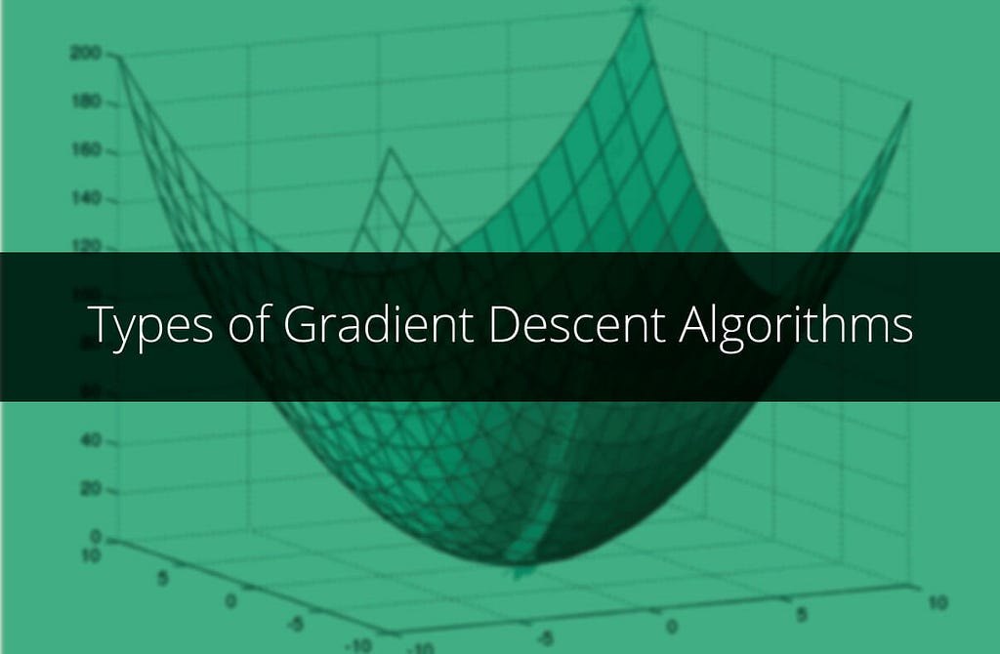

*Types of Gradient Descent Algorithms*

## **In this article, I am going to discuss Gradient Descent in detail, explaining the different algorithms for optimisation apart from the standard gradient descent algorithm.**

To discuss the various gradient descent algorithms, I am going to use the Logistic Regression’s Loss function as the ‘*to be optimised*’ function.

For those who are not aware of Logistic Regression,

> Logistic Regression is a statistical technique with the input variables (independent variables or regressors) as continuous variables and the output variable (dependent variable or regressand) as a binary variable. In terms of effect, a unit change in the input variable will multiply the odds of the output variable by a constant factor.

Logistic Regression is widely used as a classification technique. Let us consider the following regression equation where the response variable *y* is a categorical variable with two classes.

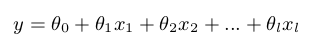

*Logistic Regression Equation*

To classify objects we will obtain probability that an object belongs to class ‘1’. To predict probability we will use output of linear model and logistic function:

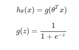

*Finding probability of an example belonging to a class*

The objective of gradient descent is to find out optimal parameters that result in optimising a given function. In the Logistic Regression algorithm, the optimal parameters *θ* are found by minimising the following loss function:

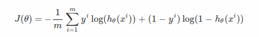

*Loss function of Logistic Regression (m: number of training examples)*

The most basic and vastly used optimisation technique to minimise the above function is ***Gradient Descent.*** It is an iterative optimisation algorithm to find the minimum of a function. To find the local minimum using gradient descent, steps proportional to the negative of the gradient of the function at the current point are taken. If taken in the positive direction, the algorithm finds local maximum and this process is called as ***Gradient Ascent.***

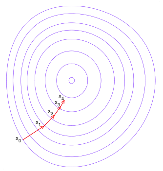

*Illustration of each iteration of Gradient Descent [Source: Wikipedia]*

> Gradient descent is based on the observation that if a multi-variate function *F* is defined and differentiable in a neighbourhood of a point *x*, then the function *F* decreases fastest if one goes from the point *x* in the direction of the negative gradient of *F* at the point *x*.

For the Loss Function *J* defined above, the gradient at a point *j* is defined as,

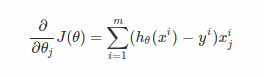

*Gradient at a point — ΔJ*

The derivation for the above equation is given below, [Credits: [Avitus](https://math.stackexchange.com/users/80800/avitus)]

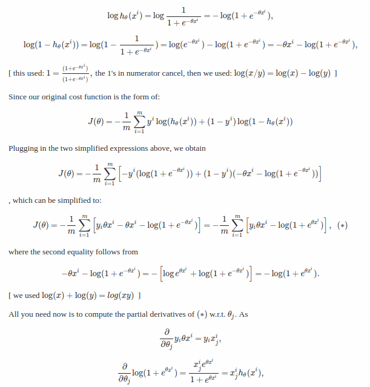

*Derivation of Gradient at a point*

## Standard Gradient Descent Algorithm

The standard gradient descent algorithm is defined as follows where *η* is the learning rate.

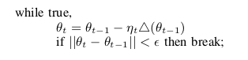

*Gradient Descent Algorithm*

After the last iteration the above algorithm gives the best values of *θ* for which the function *J* is minimum. The disadvantage of this algorithm is that in every iteration *m* gradients have to be computed accounting to *m* training examples. If the training set is very huge, the above algorithm is going to be memory inefficient and might crash if the training set doesn’t fit in the memory. In such cases, the Stochastic Gradient Descent algorithm is going to be helpful.

## **Stochastic Gradient Descent**

Unlike the traditional algorithm which computes true gradient, in stochastic gradient descent algorithm’s iteration, the gradient is computed against a single randomly chosen training example. The algorithm is defined as follows.

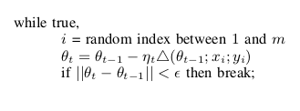

*Stochastic Gradient Descent Algorithm*

In each iteration, a random index between *1* and *m (number of training examples)* is chosen and the gradient is computed only with respect to the training example at the chosen index. Several passes can be made over the training set until the algorithm converges. If this is done, the data can be shuffled for each pass to prevent cycles.

Of course, this method has its advantages and limitations.

1. Noisy updates leads to fluctuations (noisy approximations).
2. Needs only one example in each step.
3. Can be used in online setting.
4. Learning rate *η* should be chosen carefully.

A compromise between computing the batch gradient and the gradient at a single example is to compute the gradient against more than one training example (called a “mini-batch”) at each step.

## **Mini-Batch Gradient Descent**

In mini batch gradient descent, in each iteration *z* random indices are chosen between *1* and *m* and the gradient is computed over the training examples at these random indices. The algorithm is defined as follows.

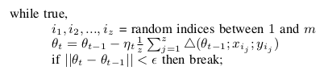

*Mini Batch Gradient Descent Algorithm*

This can perform significantly better than the stochastic gradient descent described, because the code can make use of vectorization libraries rather than computing each step separately. It may also result in smoother convergence, as the gradient computed at each step is averaged over more training examples.

## Momentum Gradient Descent

Here, I’ll talk about a simple addition to the Stochastic Gradient Descent algorithm called momentum which often works better and faster than the Stochastic Gradient Descent algorithm. Momentum or Stochastic Gradient Descent with momentum is a method which helps accelerate gradients vectors in the right directions (shown below), thus leading to faster convergence. It is one of the most popular optimisation algorithms and many state-of-the-art models are trained using it. Before diving into the math, lets explore the idea behind the momentum gradient descent algorithm

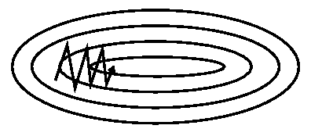

*SGD without momentum (Source: [Genevieve B. Orr](https://www.willamette.edu/~gorr/classes/cs449/momrate.html))*

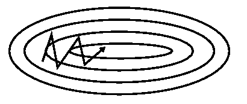

*SGD with momentum (Source: [Genevieve B. Orr](https://www.willamette.edu/~gorr/classes/cs449/momrate.html))*

Exponentially weighed averages deal with sequences of numbers. Suppose, we have some sequence S which is noisy. For this example I plotted cosine function and added some Gaussian noise. It looks like this:

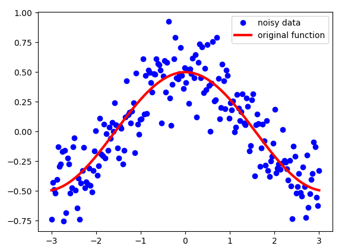

*Credits: [Vitaly Bushaev](https://towardsdatascience.com/@bushaev?source=user_popover)*

Note, that even though these dots seem very close to each over, none of them share *x* coordinate. It is a unique number for each point. That’s the number the defines the index of each point in our sequence S.

What we want to do with this data is, instead of using it, we want some kind of ‘moving’ average which would ‘denoise’ the data and bring it closer to the original function. Exponentially weighed averages can give us a pictures which looks like this:

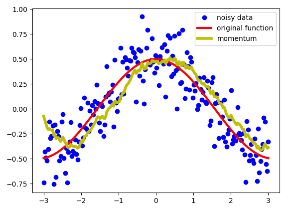

*Credits: [Vitaly Bushaev](https://towardsdatascience.com/@bushaev?source=user_popover)*

As you can see, that’s a pretty good result. Instead of having data with a lot of noise, we got much smoother line, which is closer to the original function than data we had. Exponentially weighed averages define a new sequence V with the following equation:

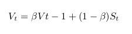

That sequence V is the one plotted yellow above. *β* is another hyper-parameter which takes values from 0 to one. I used *beta* = 0.9 above. It is a good value and most often used in SGD with momentum. Intuitively, you can think of *β* as follows. We’re approximately averaging over last *1 / (1- β)* points of sequence. Let’s see how the choice of *β* affects our new sequence V.

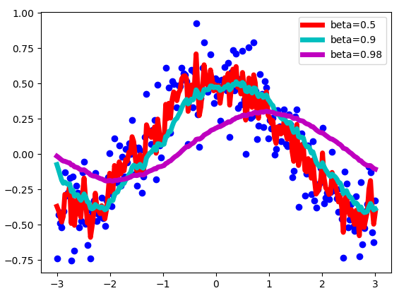

As you can see, with smaller numbers of β, the new sequence turns out to be fluctuating a lot, because we’re averaging over smaller number of examples and therefore are ‘closer’ to the noisy data. With bigger values of β, like β*=0.98*, we get much smother curve, but it’s a little bit shifted to the right, because we average over larger number of example(around 50 for β*=0.98*). β *= 0.9* provides a good balance between these two extremes.

The momentum gradient descent algorithm is defined as follows.

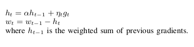

*Momentum gradient descent algorithm*

## Nesterov Momentum Gradient Descent Algorithm

**Nesterov Momentum** is a slightly different version of the momentum update that has recently been gaining popularity. In this version we’re first looking at a point where current momentum is pointing to and computing gradients from that point. It becomes much clearer when you look at the picture.

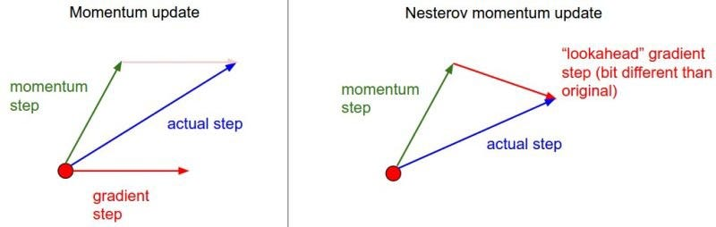

Nesterov momentum algorithm is defined below.

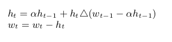

*Nesterov momentum algorithm formulas*

## Conclusion

I hope this post helped you learn different types of Gradient descent algorithms with respect to Logistic Regression. Momentum gradient descent is actually one of the most popular optimisation algorithms in deep learning and used very often than more advanced ones.

I will post another article describing the advanced gradient descent algorithms like Ada Grad, RMS Prop, Adam Gradient Descent etc.

Please post your thoughts on the article in the comments below.

## References

1. Advanced Machine Learning course on Coursera
2. Distill, [Why Momentum really works](https://distill.pub/2017/momentum/)
3. [Towards Data Science](https://towardsdatascience.com/stochastic-gradient-descent-with-momentum-a84097641a5d)

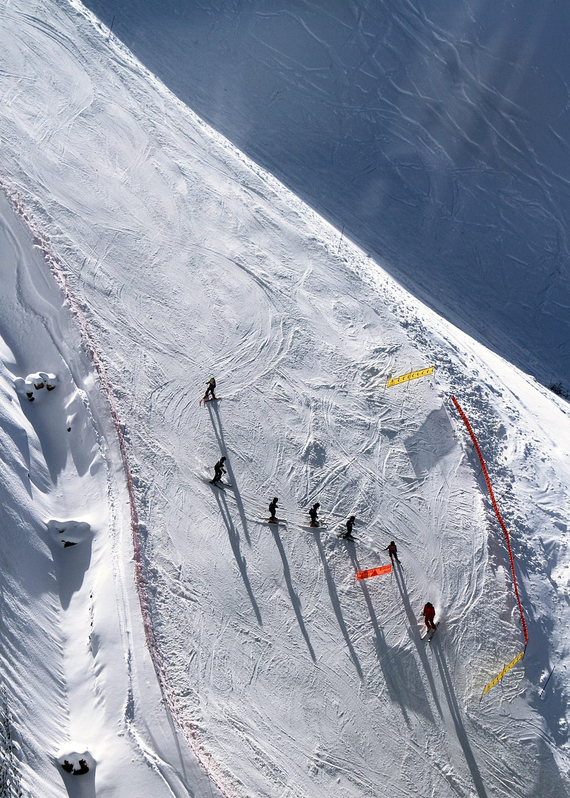

*Photo by [Toa Heftiba](https://unsplash.com/photos/D_mFA0GZuAs?utm_source=unsplash&utm_medium=referral&utm_content=creditCopyText) on [Unsplash](https://unsplash.com/search/photos/skiing?utm_source=unsplash&utm_medium=referral&utm_content=creditCopyText)*
