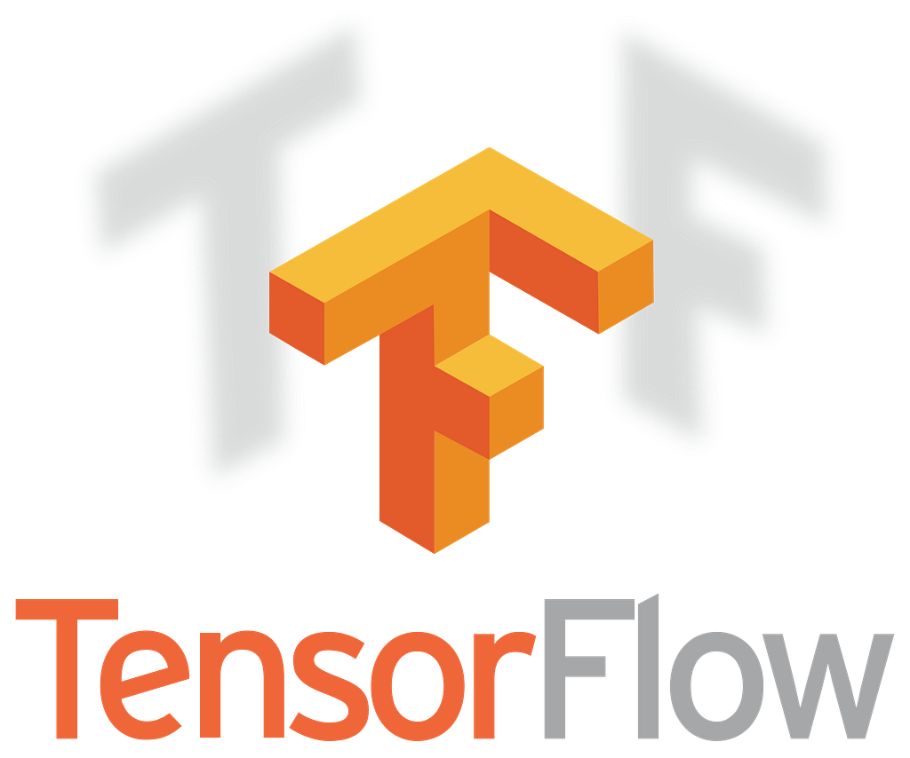
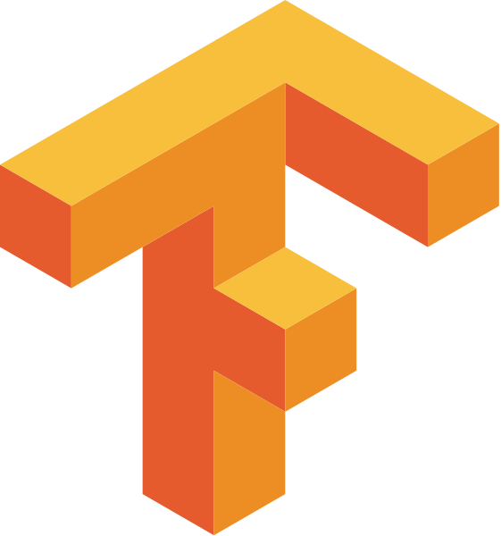
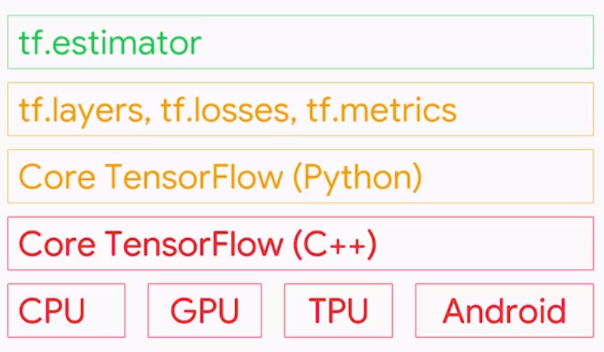
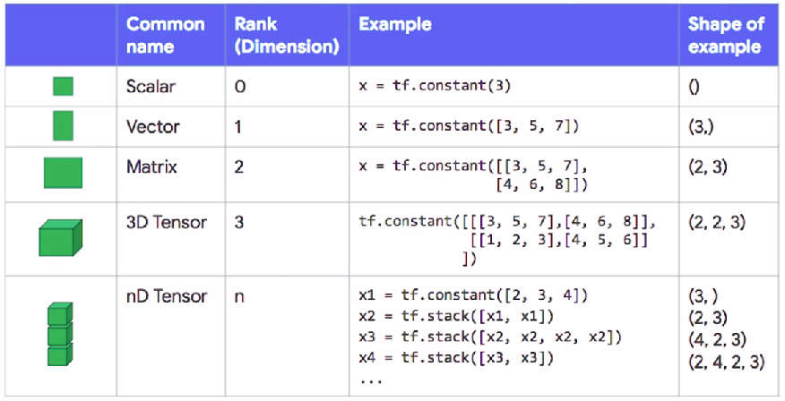
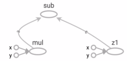
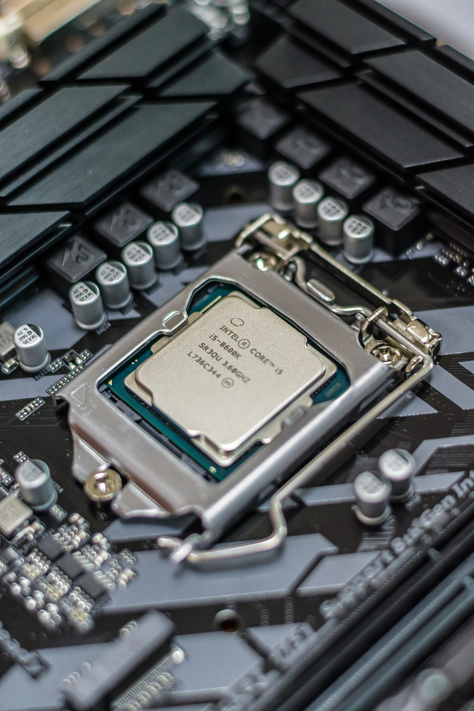

*[Source: www.tensorflow.org]*

This is the first article in the series of articles I am going to pen down giving an introduction to TensorFlow and diving deep into to the myriad Math and Machine Learning libraries it offers. To begin with, I would describe, in this article, the idea behind the TensorFlow framework, the way its structured, its key components etc. By the end of this article, you will be able to write simple numerical solver code snippets in TensorFlow.

For those who are not aware,

> TensorFlow is a computational framework for building machine learning models. It is the second generation system from Google Brain headed by Jeff Dean. Launched in early 2017, it has disrupted the ML world by bringing in numerous capabilities from scalability to building production ready models.
> [Credits: Wikipedia]



*[Source: www.tensorflow.org]*

### The Framework



*TensorFlow toolkit hierarchy*

TensorFlow provides a variety of different tool kits that allow you to write code at your preferred level of abstraction. For instance, you can write code in the Core TensorFlow (C++) and call that method from Python code. You can also define the architecture on which your code should run (CPU, GPU etc.). In the above hierarchy, the lowest level in which you can write your code is C++ or Python. These two levels allow you to write numerical programs to solve mathematical operations and equations. Although this is not highly recommended for building Machine Learning models, it offers a wide range of math libraries that ease your tasks. The next level in which you can write your code is using the TF specific abstract methods which are highly optimised for model components. For example, using the tf.layers method abstract you can play with the layers of a neural net. You can build a model and evaluate the model performance using the tf.metrics method. The most widely used level is the tf.estimator API, which allows you to build (train and predict) production ready models with easy. The estimator API is insanely easy to use and well optimised. Although it offers less flexibility, it has all that is needed to train and test your model. Let’s see an application of the estimator API to build a classifier using just three lines of code.

```python
classifier = tf.estimator.LinearClassifier(feature_columns=feature_columns)
classifier.train(input_fn=train_input_fn, steps=1000)
results = classifier.evaluate(input_fn=eval_input_fn)
```

In this article, I am going to use the Core TensorFlow (Python) to write code. But before doing so, let me discuss about the available data types in TensorFlow.

### Data Types

The basic data type in this framework is a **Tensor.** A Tensor is an N-dimensional array of data. For instance, you can call a Scalar (a constant value such as integer 2) as a 0-dimension tensor. A vector is a 1-dimensional tensor and a matrix is a 2-dimensional tensor. The following graphic describes each of the dimensions of a tensor in detail.



*Tensor Data Type*

Observe the preceding graphic. The variable *x* is the declared tensor using the *tf.constant* class.

**Constants:** A constant is a tensor whose value cannot be changed at all. In the first example, *x* takes a constant value 3 and hence the shape is None. You can declare any dimensional tensors by stacking up tensors on an existing tensor using the *tf.stack* function which can be seen from the example for **nD Tensor**.

Now that we have seen how to declare constants in TensorFlow, let’s look at declaring variables.

**Variables:** A variable is a tensor whose value is initialised and then typically changed as the program runs. In TensorFlow variables are manipulated by the *tf.Variable* class. The best way to create a variable is by calling the *tf.get_variable* function. This function requires you to specify the Variable’s name. This name will be used by other replicas to access the same variable, as well as to name this variable’s value when check pointing and exporting models. *tf.get_variable* also allows you to reuse a previously created variable of the same name, making it easy to define models which reuse layers.

```python
my_variable = tf.get_variable("my_variable", [1, 2, 3])
```

**Initialising Variables:** As theCore Tensorflow, which is a low level API, is being used, the variables need to be explicitly initialised. If a high level framework like *tf.Estimator* or *Keras* are being used, the variables will be automatically be initialised for you. To initialise the variables, the *tf.global_variables_initializer* needs to be called. You can initialise all the variables in a session using the following line of code.

```python
session.run(tf.global_variables_initializer())
```

But what is *session.run*?? What are sessions?

### Sessions and Graphs

A session encapsulates the state of the TensorFlow runtime, and runs TensorFlow operations. Every line of code you write using TensorFlow is represented by an underlying graph. Let’s understand this with an example below.

```python
x = tf.constant([1, 2, 3])
y = tf.constant([4, 5, 6])
z1 = tf.add(x, y)
z2 = tf.multiply(x, y)
z3 = tf.subtract(z2, z1)
```

I have created two 1D tensors *x* and *y.* I added them and stored it in a variable called *z1*. I multiplied them and stored it in a variable *z2*. I created another variable *z3* by subtracting *z1* from *z2*. When this particular code snippet is executed, TensorFlow **does not compute the results** but creates a graph (shown below) representing the above code.



*TensorFlow Graph*

The idea behind utilising graphs is to create portable code. Yes, this graph can be exported and used by anybody on any type of architecture. But, why does TensorFlow not compute the results? Because, it follows the lazy evaluation paradigm. All graphs created are tied to a session and we have to tell TensorFlow to compute the results using *session.run*.

```python
session.run(z3)
```

Remember this, If a *tf.Graph* is like a *.py* file, a *tf.Session* is like the python executable.

Now that we know the basics of Sessions, Graphs, Data Types and how to create variable, lets get our hands dirty by writing some TensorFlow code.

## TensorFlow Code

### Addition and Subtraction

```python
x = tf.constant([10, 20, 30])
y = tf.constant([1, 2, 3])

addition = tf.add(x, y)
subtraction = tf.subtract(x, y)

with tf.Session() as session:
    print(session.run(addition))
    print(session.run(subtraction))
```

### Multiplication and Division

```python
x = tf.constant([10, 20, 30])
y = tf.constant([1, 2, 3])

multiplication = tf.multiply(x, y)
division = tf.divide(x, y)

with tf.Session() as session:
    print(session.run(multiplication))
    print(session.run(division))
```

### Reshaping

```python
matrix = tf.constant([[1, 2], [3, 4], [5, 6]])
reshaped = tf.reshape(matrix, [2, 3])

with tf.Session() as session:
    print(session.run(reshaped))
```

### I have written a quadratic equation solver using just the simple operations I discussed above and the code for the same is available on my GitHub repository. [[Link](https://github.com/avinashingit/TensorflowProjects/blob/master/Programming/Halleys%20Equation%20Solver.ipynb)]

## Conclusion

Mostly TensorFlow is used as a backend framework whose modules are called through Keras API. Typically, TensorFlow is used to solve complex problems like Image Classification, Object Recognition, Sound Recognition, etc. In this article, we have learnt about the structure and components of TensorFlow. In the next article, we shall dive into Machine Learning and build our first Linear Regression model using TensorFlow.

A few resources to learn about TensorFlow in depth:

1. [TensorFlow](https://www.tensorflow.org) documentation.
2. Introduction to TensorFlow MOOC on Coursera.

Stay tuned and follow me for notifications on my further articles.

Github: [Link](https://github.com/avinashingit)
Linkedin: [Link](https://www.linkedin.com/in/avinashkadimisetty)



*Photo by [Alexandru-Bogdan Ghita](https://unsplash.com/photos/eM6WUs4nKMY?utm_source=unsplash&utm_medium=referral&utm_content=creditCopyText) on [Unsplash](https://unsplash.com/search/photos/intel?utm_source=unsplash&utm_medium=referral&utm_content=creditCopyText)*
